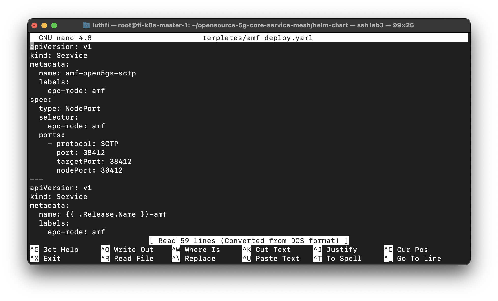
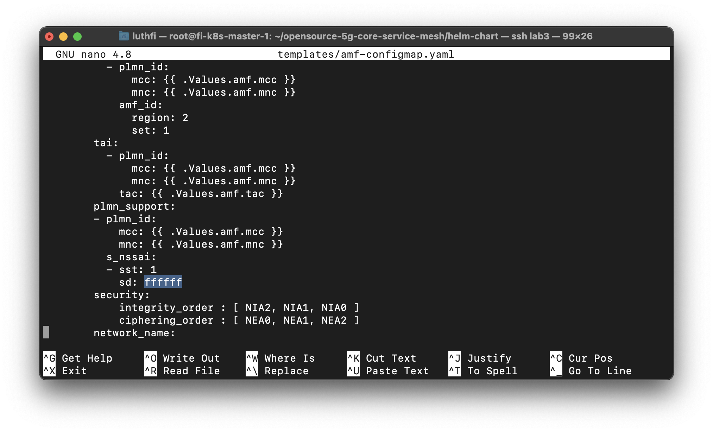
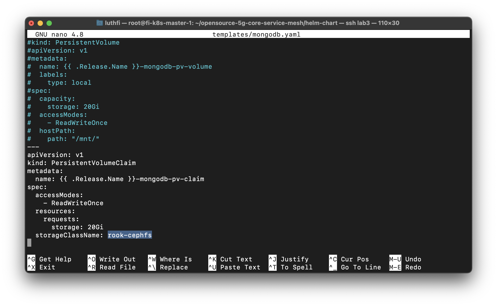
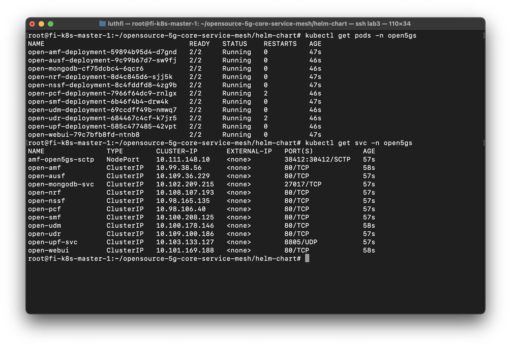
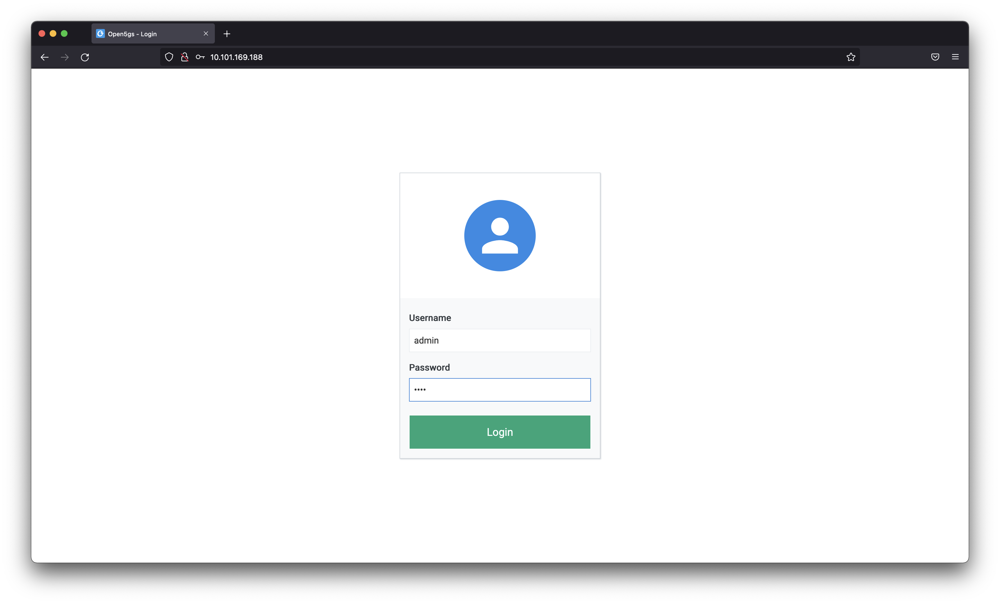
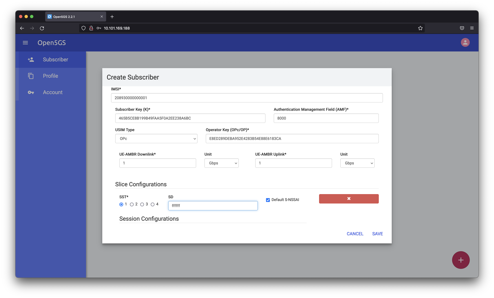
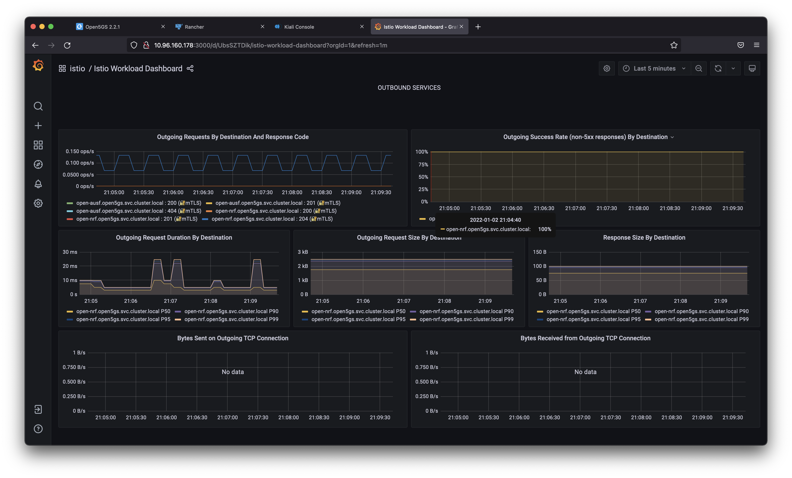

---
> Specification : Kubernetes, HELM, Istio, Open5Gs, ROOK, CEPH, Rancher

### **Lab Topology**


#### Create Namespaces for practices
```
kubectl create ns open5gs
```

#### Install Service mesh Istio (optional)
```
curl -L https://istio.io/downloadIstio | sh -
cd istio-1.12.1
export PATH=$PWD/bin:$PATH
istioctl install --set profile=demo -y
```

Add a namespace label to instruct Istio to automatically inject Envoy sidecar proxies when you deploy your application later:

```
kubectl label namespace open5gs istio-injection=enabled
```

**Install Addons packages**

```
cd ~/istio-1.12.1/samples/addons
kubectl apply -f prometheus.yaml #for data sources monitoring
kubectl apply -f kiali.yaml #for dashboard visualization istio
kubectl apply -f jaeger.yaml #for tracing log
kubectl apply -f grafana.yaml #for dashboard monitoring (visualization)
```


#### Install Rancher (optional)
```
helm repo add rancher-latest https://releases.rancher.com/server-charts/latest
kubectl create namespace cattle-system
```

**Install crds Cert Manager**

```
kubectl apply -f https://github.com/jetstack/cert-manager/releases/download/v1.5.1/cert-manager.crds.yaml
```

**Add the Jetstack Helm repository**

```
helm repo add jetstack https://charts.jetstack.io
```

**Update your local Helm chart repository cache**

```
helm repo update
```

**Install the cert-manager Helm chart**
```
helm install cert-manager jetstack/cert-manager \
  --namespace cert-manager \
  --create-namespace \
  --version v1.5.1
```

****
```
kubectl get pods --namespace cert-manager
```

#### Install Rancher with Helm
```
helm install rancher rancher-latest/rancher \
  --namespace cattle-system \
  --set hostname=rancher.my.org \
  --set replicas=3
```

**Wait for Rancher to be rolled out**

```
kubectl -n cattle-system rollout status deploy/rancher
```

**Verify that the Rancher Server is Successfully Deployed**

```
kubectl -n cattle-system get deploy rancher
```


#### Install HELM
We use HELM for automatic deployment in kubernetes.
```
curl -fsSL -o get_helm.sh https://raw.githubusercontent.com/helm/helm/main/scripts/get-helm-3
chmod 700 get_helm.sh
./get_helm.sh
helm version    
```

#### Clone repo for simulation
```
cd ~
git clone https://bitbucket.org/infinitydon/opensource-5g-core-service-mesh.git
git clone https://github.com/Gradiant/openverso-charts.git
```

#### Configure AMF Services (optional)
This services if you want use NodePort & can access from external cluster.

```
cd ~/opensource-5g-core-service-mesh/helm-chart
sudo nano templates/amf-deploy.yaml
```

Uncomment in AMF service amf-open5gs-sctp


#### Changed sd to ffffff in amf-configmap
```
nano templates/amf-configmap.yaml
```


#### Change mongodb configuration
We will use **ROOK Ceph** for persistent volume, need **comment existing persistent volume & add StorageClassName in persistent volume claim**.

```
nano templates/mongodb.yaml
```



#### Deploy open5gs with helm-chart 
```
cd ~/opensource-5g-core-service-mesh/helm-chart
helm -n open5gs install -f values.yaml open ./
```

#### Make sure all POD & Services already running 



#### Register UE (User Equipment in Open5Gs dashboard)
Open dashboard use IP webui services `10.101.169.188`

```
Username : admin
Password : 1423
```




Register User Equipment (UE) with detail bellow :
```
IMSI : 208930000000001
Key : 465B5CE8B199B49FAA5F0A2EE238A6BC
OP : E8ED289DEBA952E4283B54E88E6183CA
opType: OPC
apn: internet
sst: 1
sd: "ffffff"
```




### **Configure UERANSIM (UE & gNB)**
---

#### Install UERANSIM Helm depedency
```
cd ~
cd ~/openverso-charts/charts/ueransim
helm dep update ./
```

#### Change value in UE 
```
sudo nano values.yaml
```

```
mcc: '208'
mnc: '93'
tac: '7'
```

#### Change AMF Address in gNB 
You must change address to AMF POD address, check with 'kubectl get pod -o wide -n open5gs | grep amf'


```
sudo nano resources/gnb.yaml
```


#### Running UERANSIM
```
helm -n open5gs install -f values.yaml ueransim ./
kubectl get pod -n open5gs | grep ueransim
```

#### Verify Logs UE Connected to gNB & AMF

**AMF Logs**


**gNB Logs**


**UE Logs**


#### Verify ping to Internet via Rancher dashboard 

**UE Container**

Note : Bellow not show reply, because in TAP Interface (debian) not showing reply, we can see tcpdump in UPF POD.

```
ping 8.8.8.8 -I uesimtun0
```


**UPF POD**

We can see ICMP request reply, from UE IP Address & Google IP.
```
sudo apt install tcpdump
tcpdump -i ogstun
```


#### Grafana Dashboard



#### Istio Kiali Dashboard


&nbsp;
&nbsp;
#### Reference :

https://medium.com/rahasak/5g-core-network-setup-with-open5gs-and-ueransim-cd0e77025fd7

https://levelup.gitconnected.com/opensource-5g-core-with-service-mesh-bba4ded044fa

https://github.com/Gradiant/openverso-charts.git


