---
> Specification : AWS, API Gateway, Serverless, Lambda, RDS, Postman

### **Lab Topology**


&nbsp;


#### Step-by-step
- Create IAM role for allow configuration
- Create Database table with DynamoDB
- Create AWS API Gateway service
- Create Lambda function
- Testing CRUD with postman
- Verify

#### A. Create IAM role

First step is create IAM role to allow Lambda function to call AWS services, for it you can follow guide bellow :

1. Login to your AWS console, search and chose IAM menu


2. Choose `Roles` and create `role`


3. Choose AWS Services -> Lambda and Next
   


4. And you can see menu bellow


5. For integrate lambda with RDS & cloudwatch, wee need filter & checklist `cloudwatchfullaccess`


6. And the last one, search `dynamodb` and checklist full access permissions


7. Add rolename


8. Verify you already added two roles for it, and create role


---
&nbsp;

#### B. Create RDS DynamoDB Table
Next step we need create database for store data, with step bellow : 

1. Choose DynamoDB services


2. Choose Dashboard and create `Table`
   
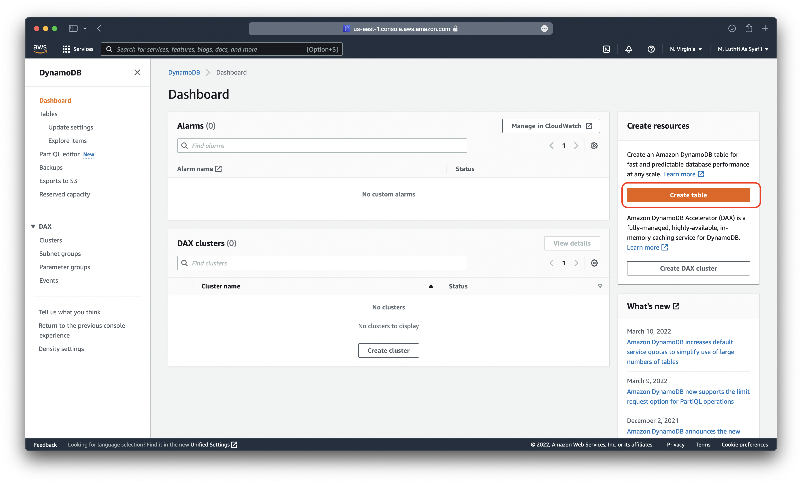

3. Put table name, you can same with our tutorial use `food-aws-serverless` and put `Partition Key` with `foodId` for indexing like bellow, and create table  
    
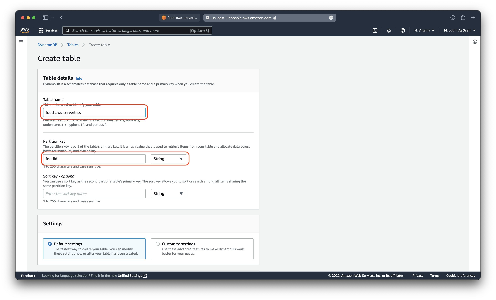

4. You can see table after created
   
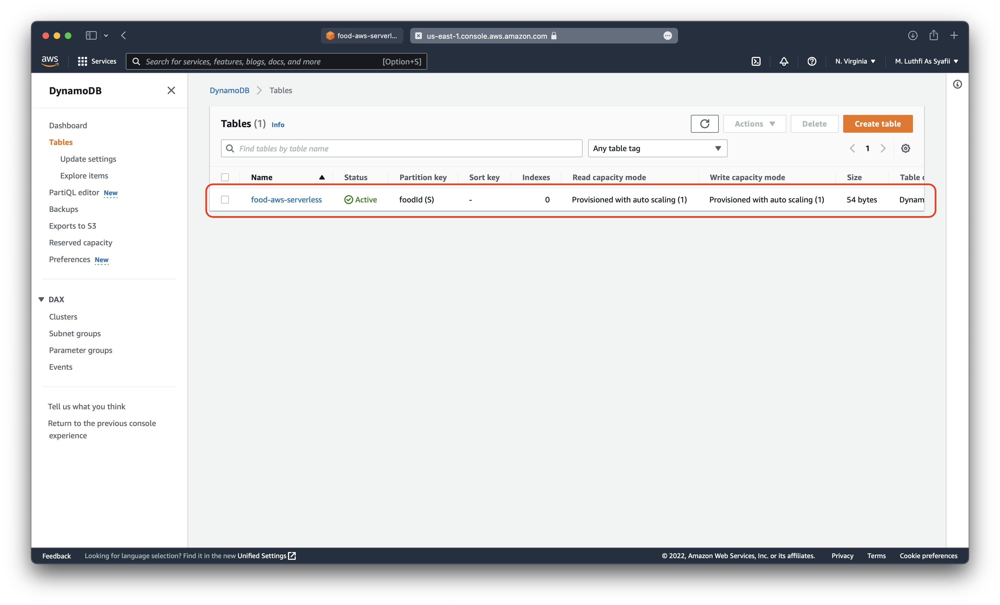

---
&nbsp;


#### C. Create Lambda Function

1. After create RDS, next create Lambda function to integrate between API Gateway to RDS DynamoDB

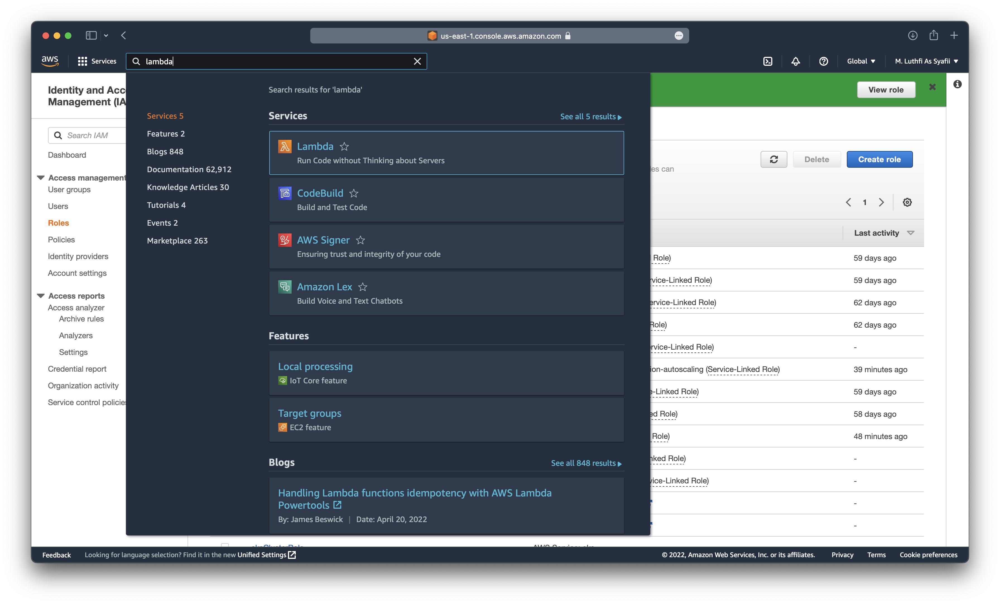

2. Choose `Functions` and `create function`

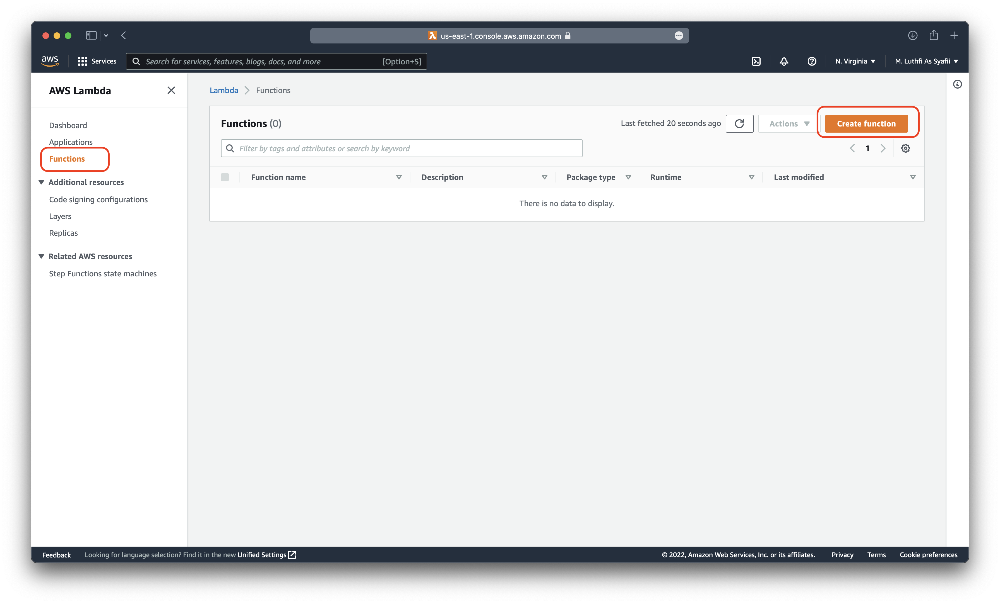

3. And follow function like bellow and create function


4. And you can see lambda function has been created, after that we need increase specs of lambda with step bellow. Click `configuration > Edit`, Increase value of Memory and Storage and save.
   


5. And `Important` step is create `lambda function` for CRUD, choose code > edit lambda_function.py > copas code from bellow > and last deploy
   


`lambda_function.py`

```python
import boto3
import json
from botocore.vendored import requests

from custom_encoder import CustomEncoder
import logging
logger = logging.getLogger()
logger.setLevel(logging.INFO)

dynamodbTableName = 'food-aws-serverless'
dynamodb = boto3.resource('dynamodb')
table = dynamodb.Table(dynamodbTableName)

getMethod = 'GET'
postMethod = 'POST'
patchMethod = 'PATCH'
deleteMethod = 'DELETE'
healthPath = '/health'
foodPath = '/food'

def lambda_handler(event, context):
    logger.info(event)
    httpMethod = event['httpMethod']
    path = event['path']
    if httpMethod == getMethod and path == healthPath:
        response = buildResponse(200)
    elif httpMethod == getMethod and path == foodPath:
        response = getFood(event['queryStringParameters']['foodId'])
    elif httpMethod == postMethod and path == foodPath:
        response = saveFood(json.loads(event['body']))
    elif httpMethod == patchMethod and path == foodPath:
        requestBody = json.loads(event['body'])
        response = modifyFood(requestBody['foodId'], requestBody['updateKey'], requestBody['updateValue'])
    elif httpMethod == deleteMethod and path == foodPath:
        requestBody = json.loads(event['body'])
        response = deleteFood(requestBody['foodId'])
    else:
        response = buildResponse(404, 'Sorry, Not Found')
    
    return response

def getFood(foodId):
    try:
        response = table.get_item(
            Key={
                'foodId': foodId
            }
        )
        if 'Item' in response:
            return buildResponse(200, response['Item'])
        else:
            return buildResponse(404, {'Message' : 'FoodId: %s not found' % foodId})
    except:
        logger.exception('Do your custom error handling here, I am just gonna log it out there!')

def saveFood(requestBody):
    try:
        table.put_item(Item=requestBody)
        body = {
            'Operation' : 'SAVE',
            'Message' : 'SUCCESS',
            'Item' : requestBody
        }
        return buildResponse(200, body)
    except:
        logger.exception('Do your custom error handling here, I am just gonna log it out there!')

def modifyFood(foodId, updateKey, updateValue):
    try:
        response = table.update_item(
            Key={
                'foodId': foodId
            },
            UpdateExpression='set %s = :value' % updateKey,
            ExpressionAttributeValues={
                ':value': updateValue
            },
            ReturnValues='UPDATED_NEW'
        )
        body = {
            'Operation': 'UPDATE',
            'Message': 'SUCCESS',
            'UpdatedAttrebutes': response
        }
        return buildResponse(200, body)
    except:
        logger.exception('Do your custom error handling here, I am just gonna log it out there!')

def deleteFood(foodId):
    try:
        response = table.delete_item(
            Key={
                'foodId': foodId
            },
            ReturnValues='ALL_OLD'
        )
        body = {
            'Operation': 'DELETE',
            'Message': 'SUCCESS',
            'UpdatedAttrebutes': response
        }
        return buildResponse(200, body)
    except:
        logger.exception('Do your custom error handling here, I am just gonna log it out there!')


def buildResponse(statusCode, body=None):
    response = {
        'statusCode' : statusCode,
        'headers' : {
            'Content-Type': 'application/json',
            'Access-Controll-Allow-Origin': '*'
        }
    }
    if body is not None:
        response['body'] = json.dumps(body, cls=CustomEncoder)
    return response

```


6. And last on is create new file named `custom_encoder.py` > put code bellow > and `deploy` again.

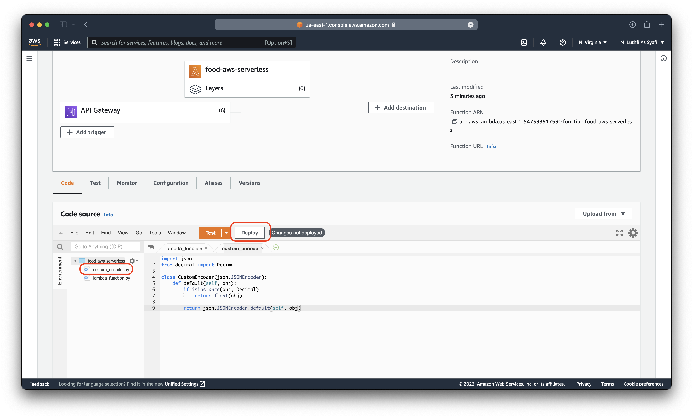

`custom_encoder.py`

```
import json
from decimal import Decimal

class CustomEncoder(json.JSONEncoder):
    def default(self, obj):
        if isinstance(obj, Decimal):
            return float(obj)

        return json.JSONEncoder.default(self, obj)
```

&nbsp;

---
&nbsp;

#### D. Create AWS API Gateway
Next is create Rest API gateway, to interact between and user & AWS services, for more you can follow bellow step :

1. Choose `AWS API Gateway` menu


2. Choose `Public REST API` and `build`

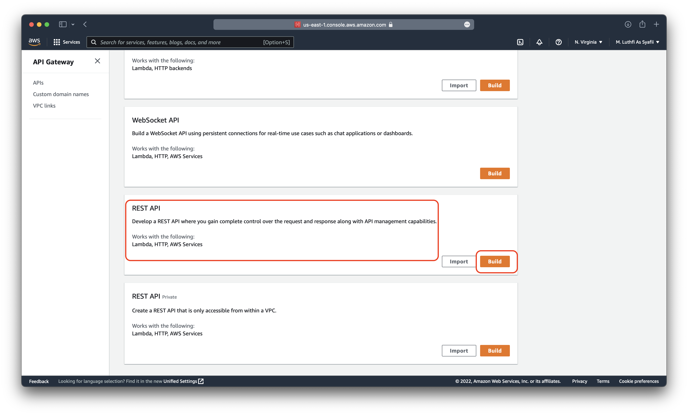

3. Click REST > New API and put API name
   
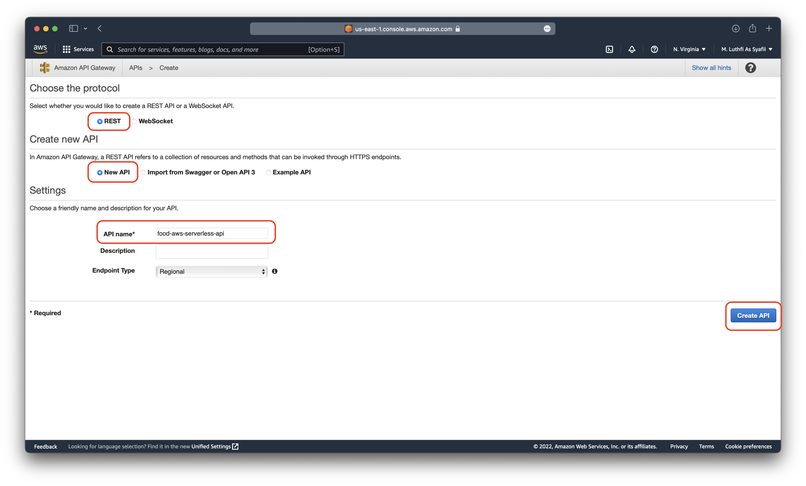

4. And next `create Resource` for place are API Method, bellow for detail structure :

```
1. Resource /health
Method GET

2. Resource /food
Method GET, POST, PATCH, DELETE

3. Resource /foods (optional, not important)
Method GET, POST, PATCH, DELETE
```


4. Input `Resource name`, `Resource path` and checklist Enable API Gateway


5. And create also for /food resource like above


6. After create `Resource`, next create `Method` for every resource. Click Resource name, for example `/health` > Create Method 

```
1. Resource /health
Method GET

2. Resource /food
Method GET, POST, PATCH, DELETE

3. Resource /foods (optional, not important)
Method GET, POST, PATCH, DELETE
```


7. Chose Method, for example `GET` and click OK

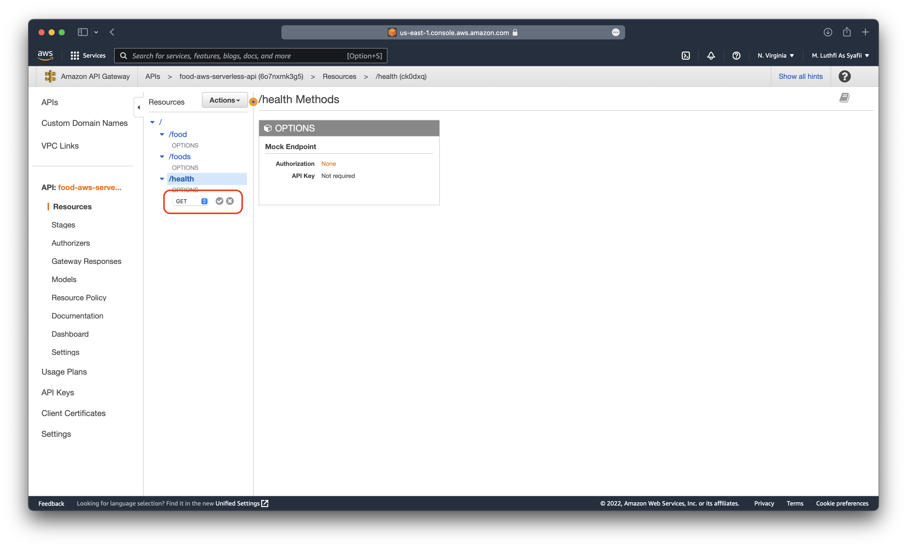

8. Checklist `Lambda Function` > Proxy integration > and chose `Lambda Function` previously created > save


9. Click OK for continue, and REPEAT create Method for `every resource` like it and follow structure 


10. After all `Method and Resource` has been created, last step is `Deploy API` like bellow


11. Create new stage name, for example: `prod`, and finish you already created API Gateway


---

&nbsp;

#### E. Testing & Verify CRUD

1. Before testing, you need download `Postman Application` for testing API, download on : https://www.postman.com/downloads/ 
2. First step is copy API Endpoint in APIs menu to access from public internet 


##### GET Option (Health Check)
To check API status reached or not, with status 200 OK


##### POST Option 
To Put new database to RDS via Json format file (key-value), bellow example to add data :

```
{
    "foodId": "001",
    "name": "Banana",
    "price": "500"
}
```

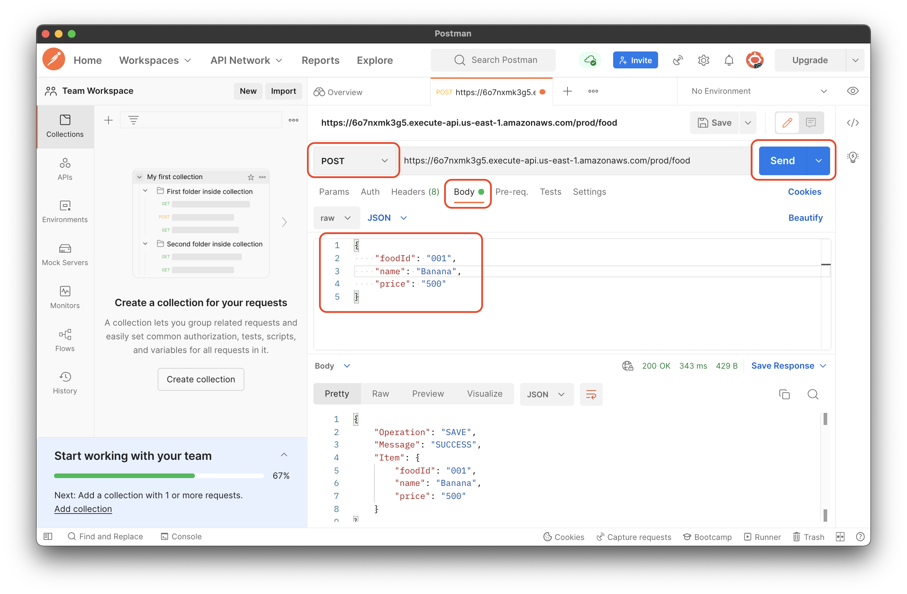


And you can see result success POST in DynamoDB table menu :

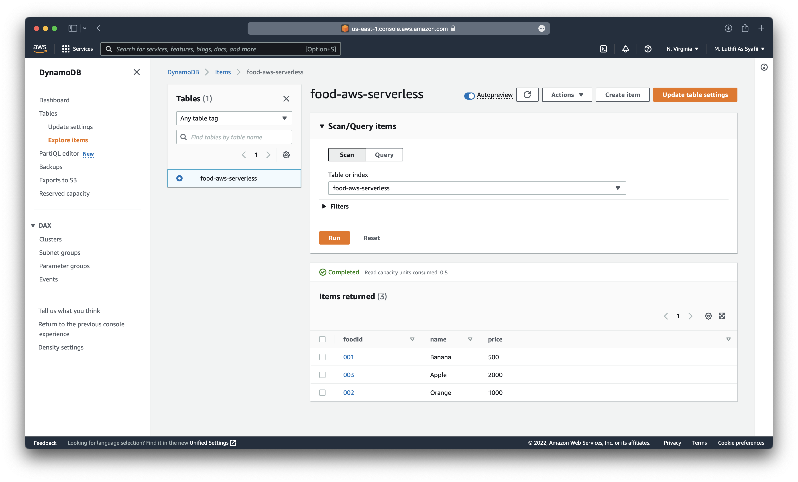

##### DELETE Option
For delete database on RDS you can use delete option with index ID (foodId) like bellow 


And you can see after deleted foodId = 002 on RDS Table 


##### GET Option
To check detail table by foodId


##### PATCH Option
Patch you can use for update about value/key, bellow example for update banana price, from 500 to 99999

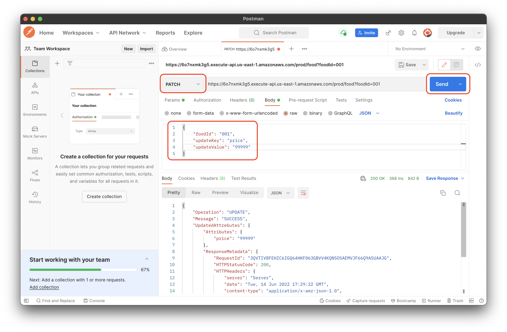


---

&nbsp;

#### Reference 
- Felix Yu Channel : https://www.youtube.com/watch?v=9eHh946qTIk&list=LL&index=32&t=159s