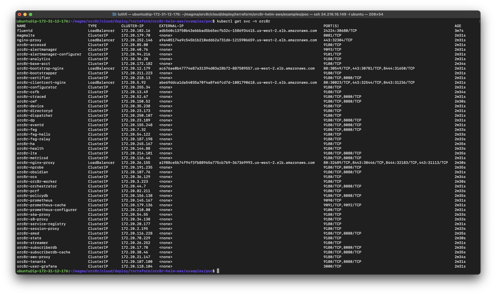
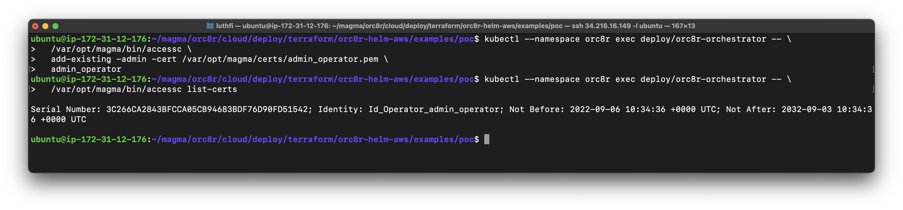

---
> Specification : Amazon Web Services, Magmacore, 5G, Cloud, OpenStack, AGW, IaaS

## **Lab Diagram**


&nbsp;
&nbsp;

---
&nbsp;


### **Summary steps**
- Create VM Deployer (EC2)
- Install terraform & others depedencies
- Setup & Deploy Magma orchestrator 
- Create AGW VM on openstack
- Install & connecting to Magma orchestrator
- Verify connected


### **Prerequisites**
- AWS Account
- Public Domain
- OpenStack cluster (optional)
  - Can change using others platform (KVM, Virtualbox, or others.)

&nbsp;
## **A. Deploy Magma Orchestrator**
### **1. Setup AWS IAM**
Create Users and use **administrator** permission access


### **2. Deploy terraform EC2**
- VM for deployer you can use ec2 instances or directly from local access AWS IAM.
- In this case, i am using ec2 because to make sure not have connection issue during deploy magma. 


Follow step like bellow, choose ubuntu 20.04


Add your **key-pair** for access 


Make sure you can access deployer VM


### **3. Install depedency**


```
sudo apt update
sudo apt install python3-pip
sudo pip install boto3
```

### **4. Install Terraform**
Use version 1.0.11, tested in this lab

```
wget -O- https://apt.releases.hashicorp.com/gpg | gpg --dearmor | sudo tee /usr/share/keyrings/hashicorp-archive-keyring.gpg
gpg --no-default-keyring --keyring /usr/share/keyrings/hashicorp-archive-keyring.gpg --fingerprint
echo "deb [signed-by=/usr/share/keyrings/hashicorp-archive-keyring.gpg] https://apt.releases.hashicorp.com $(lsb_release -cs) main" | sudo tee /etc/apt/sources.list.d/hashicorp.list
sudo apt update
sudo apt install terraform=1.0.11
```


### **5. Install AWS CLI & Login**

```
cd ~
curl "https://awscli.amazonaws.com/awscli-exe-linux-x86_64.zip" -o "awscliv2.zip"
unzip awscliv2.zip
sudo ./aws/install
```


Login to your AWS Account using **Access key & secret key**, you can download from when creating user above. 


### **6. Preparation & Assemble Certificates**
Clone Magma repository, choose branch and add environment variable **(important)**


```
git clone https://github.com/magma/magma
git checkout -b v1.7.0
cd magma
export MAGMA_ROOT=/home/ubuntu/magma
```


##### Create & generate secrets

Make sure you have **Public Domain (DNS)** because later will use for connection between AGW & Orchestrator

```
mkdir -p ~/secrets/certs
cd ~/secrets/certs

${MAGMA_ROOT}/orc8r/cloud/deploy/scripts/self_sign_certs.sh orc8r.rsch-lab.com
${MAGMA_ROOT}/orc8r/cloud/deploy/scripts/create_application_certs.sh orc8r.rsch-lab.com
```


And next create `admin_operator.pfx` for authentication to **Magma API**


```
openssl pkcs12 -export -inkey admin_operator.key.pem -in admin_operator.pem -out admin_operator.pfx
ls -lah ~/secrets/certs/
```


### **7. Magma orchestrator installation**
We will use `Helm` for deploying orchestrator, go to examples directory, you can choose :

- **Blue-green** = Build from scratch, you can custom anything
- **POC** = Build orchestrator with minimal specs (we choose this because limitation on credit)
- **Remote** = Store terraform state on S3 and locked by DyanamoDB Table
- **Basic** = Build with standar specification

```
cd ${MAGMA_ROOT}/orc8r/cloud/deploy/terraform/orc8r-helm-aws/examples/
cd poc 
```


##### Edit several values
You just configure values bellow :


- **Region orc8r** = Your AWS Region will deploy
- **EKS Cluster scaling** = By default on POC use 8, but we increase to 12
- **Orchestrator Domain** = Using your public domain
- **Region orc8r-app** = Same with orc8r region
- **Deployment type** = You can use fwa, federated_fwa or all


##### Deploy orchestrator 
This difficult step, if any issue you can check first by **terraform result**


```
terraform init 
terraform apply -target=module.orc8r
terraform apply -target=module.orc8r-app.null_resource.orc8r_seed_secrets
terraform apply
```


Make sure all terraform running **smoothly**

&nbsp;

##### **Install kubectl**
Install for manages kubernetes cluster with CLI

```
sudo apt-get update
sudo apt-get install -y ca-certificates curl 
sudo curl -fsSLo /usr/share/keyrings/kubernetes-archive-keyring.gpg https://packages.cloud.google.com/apt/doc/apt-key.gpg
echo "deb [signed-by=/usr/share/keyrings/kubernetes-archive-keyring.gpg] https://apt.kubernetes.io/ kubernetes-xenial main" | sudo tee /etc/apt/sources.list.d/kubernetes.list
sudo apt-get update
sudo apt-get install -y kubectl
```


Change kubeconfig using `kubeconfig_orc8r` or you can move this one to `./kube/config`
```
cd ${MAGMA_ROOT}/orc8r/cloud/deploy/terraform/orc8r-helm-aws/examples/poc
aws eks update-kubeconfig --name orc8r --region us-west-2
export KUBECONFIG=$(realpath kubeconfig_orc8r)
```

**Verify cluster EKS running**

```
kubectl get node
```


**Verify All POD Orchestrator running**


**Verify All Services Orchestrator**


### **8. Register nameserver**
Register result of **terraform output** to your DNS Provider, like bellow :


### **9. Pre-usages Orchestrator**
Before using magma orchestrator, we need follow guide bellow first :

##### Create an Orchestrator Admin User
Just **copy-paste** no change anything 


```
kubectl --namespace orc8r exec deploy/orc8r-orchestrator -- \
  /var/opt/magma/bin/accessc \
  add-existing -admin -cert /var/opt/magma/certs/admin_operator.pem \
  admin_operator
```

Verify success 

```
kubectl --namespace orc8r exec deploy/orc8r-orchestrator -- \
  /var/opt/magma/bin/accessc list-certs
```



##### Create an Orchestrator NMS User
This user for access to Magma NMS GUI

**Format Create user**

```
kubectl --namespace orc8r exec -it deploy/nms-magmalte -- \
  yarn setAdminPassword <ORGANIZATION> <USERNAME> <PASSWORD>
```

**1. User for MAGMA-TEST organization**
```
kubectl --namespace orc8r exec -it deploy/nms-magmalte -- \
  yarn setAdminPassword magma-test admin-mgm passwordstrong
```

**2. User for MASTER organization**

```
kubectl --namespace orc8r exec -it deploy/nms-magmalte -- \
  yarn setAdminPassword master admin passwordstrong
```


&nbsp;

### **10. Manages NMS Magma**
First, you need login to your domain with format bellow :

```
https://organization-name.nms.yourdomain
```


##### Create network
After that we need create network, to add **AGW** Later, just follow like bellow :


**Let's go to network management**


Bellow for user interface network management 


Above last of **Deploy magma orchestrator** section, next is deploy Magma AGW on OpenStack 

&nbsp;

---

## **B. Deploy Magma AGW**
First, we need create VM or Instances with specs bellow :

- OS : Ubuntu 20.04
- 2 Network Interface :  
  - eth0 = for **SGi** (internet connection, connection to Magma orc8r)
  - eth1 = for **S1** connection to eNodeB (SRSRAN)

In **OpenStack** we use external network for eth0, and internal for eth1

&nbsp;

### **1. Preparing VM**
##### Create Instance

For create instances you can follow my previous post 


##### Create S1 Port 
You need create port inside of **internal network**, Network -> Network -> Chose internal network -> Click Port and add port like bellow :


Add security groups, we use allow-all 


After port created, go to **instances** and **attach** port S1 


And you can see, VM already have 2 network interface


##### Access Instance
Makesure network configuration like bellow 


&nbsp;
### **2. Installing Magma AGW**

Note for this, we need change address like format bellow :

```
bash agw_install_ubuntu.sh IP_ADDRESS_SGi IP_GATEWAY
```

```
wget https://raw.githubusercontent.com/magma/magma/v1.6/lte/gateway/deploy/agw_install_ubuntu.sh
bash agw_install_ubuntu.sh 172.168.14.100/24 172.168.14.1
```


##### Notes : During Installation, Magma VM will rebooting 2 times, so we need reconnect SSH

After rebooting during installation, we can see `eth1` or S1 Interface interface already changed automatically


To see **progress** installation, we can check using. And `Stopped AGW Installation` indicate success installation 

```
journalctl -fu agw_installation
```


**To make sure installation success, check with**
```
sudo systemctl status magma@*
```


### **3. Configuring AGW**

First, we need **Prepare secrets & control_proxy** configuration

Create directory to plase certs configuration

```
sudo mkdir -p /var/opt/magma/tmp/certs/
sudo mkdir -p /var/opt/magma/configs
```

##### Download secrets
Download secrets from **Magma Deployer** VM previously created in step `6. Preparation & Assemble Certificates`

```
cd /var/opt/magma/tmp/certs/
sudo scp -i ~/priv-key-aws-tmp ubuntu@34.216.16.149:/home/ubuntu/secrets/certs/* .
ls
```


##### Check all AWS Route 53 address
Check on AWS Dashboard, Route 53 menu


##### Create control_proxy.yml
This file for connection from **AGW to Magma orchestrator** and save

```
sudo nano /var/opt/magma/configs/control_proxy.yml
```

```
cloud_address: controller.orc8r.rsch-lab.com
cloud_port: 443
bootstrap_address: bootstrapper-controller.orc8r.rsch-lab.com
bootstrap_port: 443
fluentd_address: fluentd.orc8r.rsch-lab.com
fluentd_port: 24224

rootca_cert: /var/opt/magma/tmp/certs/rootCA.pem
```


##### Check Hardware ID & Challenge Key
This one important, because will **Register** on the Magma orchestrator 

```
show_gateway_info.py
```


### **4. Add & Register Gateway**
We need login using magma-test organization like previous, and go to **devices menu** and **add gateway**


Put Hardware ID & Challenge Key


**Just click next,** for configuration soon when add eNodeb & UE


**Save and close**


### **5. Restarting AGW Services**

```
sudo sytemctl stop magma@*
sudo systemctl restart magma@magmad.service
```

**Wait for a time, because need time connecting**, After **connected** we can see like logs bellow :


### **6. Verify on NMS**

We can see AGW already connected from OpenStack VM to Magma orchestrator on AWS, and **GOOD** Health status.  


### **7. Access Magma API**
Othen than accessing using NMS, we can use API for manage.

##### Download admin_operator.pfx
You need download `admin_operator.pfx` from your magma orchestrator


##### Import certificates
Use firefox for accessing WEB API, import certificates like bellow 


Click **Import**, choose your previous downloaded


##### Accessing API
Go to your address, or can check on Route 53 AWS 
```
https://api.orc8r.rsch-lab.com/swagger/v1/ui/orchestrator
```


After it, you need refresh browser and `Accept risk and continue`, this issue happen because issuer **unknown** no problem, to **solved** this we can created secrets on magma installation using **Lets encrypt**.


&nbsp;

### **NEXT Part 2 : Integrate Magma AGW with eNodeB & UE Simulator with srsRAN**

&nbsp;

---

## **Thankyou to**:

###### - [Shubham Tatvamasi](https://github.com/ShubhamTatvamasi) for great documentation from you
###### -  [Magma official Documentation](https://docs.magmacore.org/docs/basics/introduction.html)


