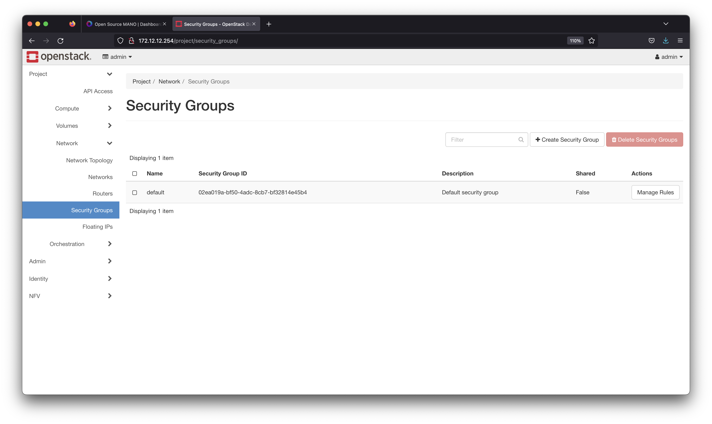

---
> Specification : OpenStack, OSM, NFV, MANO, VNF Onboarding  

## **NFV-MANO Lab Architecture**


&nbsp;
**Specification**
- OS : Ubuntu 20.04
- vCPU : 4
- RAM : 8GB
- Storage : 40 GB

 
### **Requirements**

1. **Openstack environment** (Check installation on https://luthfi.dev/posts/install-openstack-aio-with-kolla-ansible-in-ubuntu/) 
2. **Connectivity between Openstack & OSM**

&nbsp;

---

&nbsp;
### **Summary Steps**

1. Install OSM
2. Add Openstack (NFVi) to OSM MANO via VIM
3. Preparing images, network, keypair, security groups on openstack (day-0)
4. Creating & Onboarding VNF Packages
5. Verify & testing

&nbsp;  

### **This my VM for OSM**


### **1. Add regular user**
If your VM not have regular/ubuntu user, please add first because for installation later.


```
adduser ubuntu
usermod -aG sudo ubuntu
su ubuntu
cd ~
```


### **2. Download & Install OSM Packages**
This steps all packages will installed automatically with 1 command, and OSM Component running as container/POD on top off Kubernetes.


```
wget https://osm-download.etsi.org/ftp/osm-12.0-twelve/install_osm.sh
chmod +x install_osm.sh
./install_osm.sh 
```


**To continue installation, please press Y**
This installation takes 15-20 minutes, let's drink coffee first hehe.


For more detail about optional installation, you can from official document : https://osm.etsi.org/docs/user-guide/latest/03-installing-osm.html

### **3. Verification after installation**

#### **Installation success**
Make sure your installation like bellow :


#### **POD Status**

```
kubectl get pod -A
kubectl get svc -A
```


#### **OSM Dashboard**

Open your OSM Dashboard with External IP from SVC, above steps.


### **4. Open Your Openstack**
Before add Openstack to MANO, we need understand VIM URL (Openstack URL), in this case openstack using keystone/identity services using port 5000

```
Our VIM URL : http://172.12.12.254:5000/v3/
```


### **5. Add Openstack NFVi to MANO (VIM)**

**VIM** is one of MANO component, this function for handle nfvi like openstack, vmware, cloud, and others.


#### Add Openstack to VIM Accounts, like bellow:


#### Write about your openstack (NFVi) information


1. **Name** : your VIM Account name 
2. **Type** : Your NFVi type
3. **VIM URL** : Your openstack keystone API, (check above)
4. **VIM Username** : Your openstack user
5. **VIM Password** : Your openstack password
6. **VIM Project/Tenant** : Your openstack project will use for VNF
7. **Config** : This section you need if you using HTTP for connection & use floating IP for VNF management later.


#### Make sure your NFVi connected to MANO


### **6. Preparing openstack environment (Day-0)**

This section we prepared first images & network. Actually depends from your **VNF Packages** will use **existing** resources (network, keypair) or **created new** one.


#### A. Internal Network 
In this case, we create new internal network named **mgmt** for network management VNF & use **floating IP** for external connection, need connect to external network with **router**.


#### B. Images


#### C. Security Groups




---
&nbsp;
### **Understanding about VNF & NS Packages in this Lab**


Create **VNF & NS Packages** is preety complex to understand, because here named of VM (Virtual Machines) not a VNF again but vDU 
(Deployment Unit) & others complex term.

So to simply this, we created **simple VNF Packages** with 1 vDU (VM), and **create NS Packages** (Network service) for connect **eth0** to mgmt network & **eth1** to inside network.

#### Meaning 
1. **vDPU** (Virtual Deployment Unit)
2. **VNFD** (Virtual Network Function Descriptor)
3. **NSD** (Network Service Descriptor)
4. **VLD** (Virtual Link Descriptor)
5. **CP** (Connection Point)
6. **ICP & ECP** (I=Internal, E=External)
7. **NST** (Network Slice Template)
8. And many more.


If you interest to understand more about VNFD, NSD & NST you can check on official OSM : https://osm.etsi.org/docs/user-guide/latest/05-osm-usage.html

&nbsp;

---

### **7. Upload VNF Packages**

Download simple VNF Packages **here** : https://github.com/assyafii/vnf-example-packages


#### First, upload VNF packages


#### Then, upload NS packages


### **8. Onboarding Packages**
Just click instantiate, OSM Will created VM & Others from packages.


#### Choose your VIM Accounts will deployed


#### Wait for it


#### Yeay, VNF & NS Success onboarding


### **9. Verification**
This step you can verify from NFVi (Openstack) side 

#### You can see here, VNF Already created & have Floating IP


#### NS Already created also


#### You can access using Floating IP & Password used cloud_init.cfg defined before in vnfd


### **All Official Packages**

You can check all references packages (VNFD, NSD, NST) here for use cases :

https://osm.etsi.org/gitlab/vnf-onboarding/osm-packages


### **References**

- https://osm.etsi.org/docs/user-guide/latest/
- https://codilime.com/blog/how-to-configure-vnfs-using-a-virtual-network-function-descriptor/


