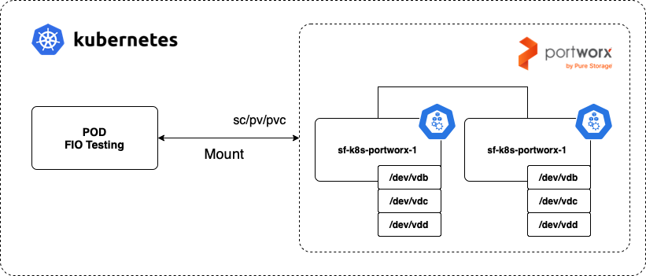
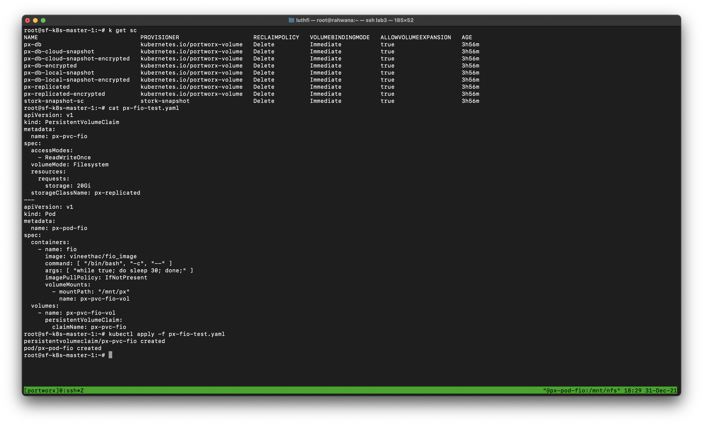

---
> Specification : Kubernetes, PortWorx, Storage

### **PortWorx storage cluster**
Portworx by Pure Storage is a cloud native storage solution, provides a fully integrated solution for persistent storage, data protection, disaster recovery, data security, cross-cloud and data migrations, and automated capacity management for applications running on Kubernetes. If you see in each of documents, portworx have big IOPS & Bandwidth.


&nbsp;
### **Lab Topology**

&nbsp;

|  IP Address  |       Nodes       |
|:------------:|:-----------------:|
| 10.20.10.230 | sf-k8s-master-1   |
| 10.20.10.235 | sf-k8s-node-1     |
| 10.20.10.241 | sf-k8s-portworx-1 |
| 10.20.10.242 | sf-k8s-portworx-2 |

#### First, make your k8s cluster already running 
If your cluster ready, you can check in previous docummentation for installation https://assyafii.com/docs/install-kubernetes-cluster-multi-master-ha/


#### Add labels px/metadata-node=true for portworx nodes

```
kubectl label nodes sf-k8s-portworx-1 sf-k8s-portworx-2 px/metadata-node=true
```

#### Create portworx template generator
**1. Login to https://central.portworx.com/specGen/wizard & choose version**


**2. Checklist use operator**


**3. You need configure KVDB Devices if production, for testing skip this**


**4. Skip network configuration**


**5. Add cluster name prefix**


**6. Apply deployment to cluster from template created**


#### Verification

**Checks status POD portworx running**
```
kubectl get pods -n kube-system
```

**If running all, check cluster portworx**
```
PX_POD=$(kubectl get pods -l name=portworx -n kube-system -o jsonpath='{.items[0].metadata.name}')
kubectl exec -it $PX_POD -n kube-system -- /opt/pwx/bin/pxctl status
```


#### Testing scenario

For test, wee will deploy POD FIO then benchmark on directory which mount to portworx cluster.



**Create PVC & POD For testing**
```
apiVersion: v1
kind: PersistentVolumeClaim
metadata:
  name: px-pvc-fio
spec:
  accessModes:
    - ReadWriteOnce
  volumeMode: Filesystem
  resources:
    requests:
      storage: 20Gi
  storageClassName: px-replicated
---
apiVersion: v1
kind: Pod
metadata:
  name: px-pod-fio
spec:
  containers:
    - name: fio
      image: vineethac/fio_image
      command: [ "/bin/bash", "-c", "--" ]
      args: [ "while true; do sleep 30; done;" ]
      imagePullPolicy: IfNotPresent
      volumeMounts:
        - mountPath: "/mnt/px"
          name: px-pvc-fio-vol
  volumes:
    - name: px-pvc-fio-vol
      persistentVolumeClaim:
        claimName: px-pvc-fio
```



**FIO Testing in directory /mnt/px**


####  Reference :

https://thenewstack.io/tutorial-install-and-configure-portworx-on-a-bare-metal-kubernetes-cluster/

https://docs.portworx.com/portworx-install-with-kubernetes/on-premise/airgapped/
