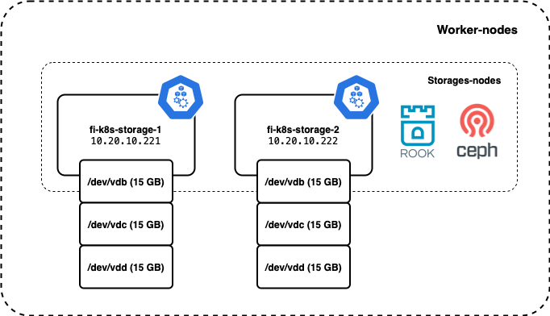
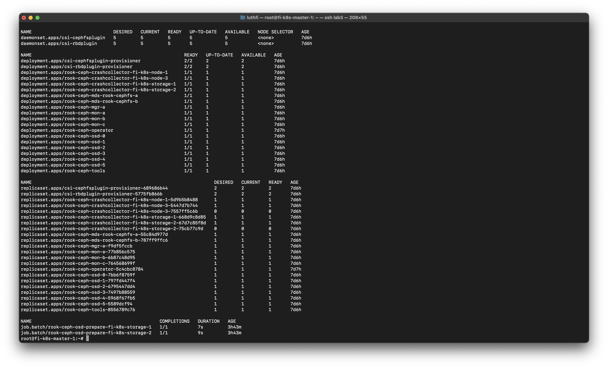
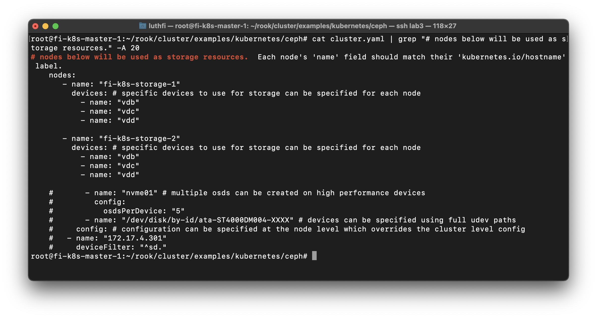

---
> Specification : Kubernetes, ROOK, CEPH

### **Lab Topology**
You can check installation kubernetes cluster in previous documentation, https://assyafii.com/docs/install-kubernetes-cluster-multi-master-ha/


&nbsp;
### **Storages nodes disks**

We use 3 disks extended (vdb, vdc, vdd) in each of storage-nodes, total 6 disks for rook cluster.

#### Detail disks



### **Master node**
---
#### Clone ROOK Project 
```
cd ~
git clone --single-branch --branch release-1.7 https://github.com/rook/rook.git
```

#### Deploy the Rook Operator
```
cd rook/cluster/examples/kubernetes/ceph
kubectl create -f crds.yaml
kubectl create -f common.yaml
kubectl create -f operator.yaml
```

#### Make sure all Rook components already UP


#### Verify the rook-ceph-operator is in the Running


#### Create a Ceph Storage Cluster
Set default namespace to rook-ceph, you can set to default namespace agaian after installation.

```
kubectl config set-context --current --namespace rook-ceph
```

##### Important : Expicitly define the nodes and raw disks devices to be used.
For any further customizations, check in [ROOK Ceph Cluster CRD documentation.](https://rook.io/docs/rook/latest/ceph-cluster-crd.html)

```
sudo nano cluster.yaml
```


#### Deploy Rook ceph cluster
`kubectl create -f cluster.yaml`

Need some minutes to deploy it, make sure all completed 
```
kubectl get -n rook-ceph jobs.batch
kubectl -n rook-ceph get cephcluster
```


#### Deploy Rook Ceph toolbox
The Rook Ceph toolbox is a container with common tools used for rook debugging and testing.

```
cd ~
cd rook/cluster/examples/kubernetes/ceph
kubectl  apply  -f toolbox.yaml
kubectl -n rook-ceph exec -it deploy/rook-ceph-tools -- bash
```

My cluster status CEPH Warning, because degraded data, but no problem.


All OSD UP


#### Create pool shared filesystem in CEPH (cephfs)

```
cd ~
cd rook/cluster/examples/kubernetes/ceph/
sudo nano filesystem.yaml
```

Write your filesystem metadata name.


Verify if metadata and data pools are created.


#### Create storage class for cephfs
```
sudo nano csi/cephfs/storageclass.yaml
kubectl create -f csi/cephfs/storageclass.yaml
kubectl get sc
```

change fsName & pool name 


Verify storage class created 


#### Last step, Testing create PVC & POD
```
kubectl create  -f  csi/cephfs/pvc.yaml
kubectl get pvc
kubectl create -f csi/cephfs/pod.yaml
kubectl get pod
```

Example manifest file PVC

```
apiVersion: v1
kind: PersistentVolumeClaim
metadata:
  name: cephfs-pvc
spec:
  accessModes:
    - ReadWriteOnce
  resources:
    requests:
      storage: 1Gi
  storageClassName: rook-cephfs
```

Example manifest file POD

```
apiVersion: v1
kind: Pod
metadata:
  name: csicephfs-demo-pod
spec:
  containers:
    - name: web-server
      image: nginx
      volumeMounts:
        - name: mypvc
          mountPath: /var/lib/www/html
  volumes:
    - name: mypvc
      persistentVolumeClaim:
        claimName: cephfs-pvc
        readOnly: false
```

#### Verify POD & PVC Already created

Persistent Volume


POD with PVC


&nbsp;
&nbsp;
#### Reference :

https://computingforgeeks.com/how-to-deploy-rook-ceph-storage-on-kubernetes-cluster/


