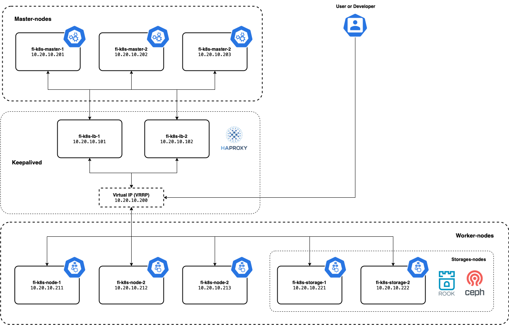

---


> Specification : Calico, Containerd, Haproxy, Kubernetes v1.22.x

### **Lab Topology**

&nbsp;
#### First, prepare all VM


### **All Nodes except LB Nodes**
---
#### Set mapping hostname 
```
nano /etc/hosts
```


#### Install packages containerd 

Load overlay and br_netfilter kernal modules.
```
cat <<EOF | sudo tee /etc/modules-load.d/containerd.conf 
overlay 
br_netfilter 
EOF
```
```
sudo modprobe overlay 
sudo modprobe br_netfilter
```

#### Set these system configurations for Kubernetes networking
```
cat <<EOF | sudo tee /etc/sysctl.d/99-kubernetes-cri.conf 
net.bridge.bridge-nf-call-iptables = 1 
net.ipv4.ip_forward = 1 
net.bridge.bridge-nf-call-ip6tables = 1 
EOF
```

#### Apply settings
```
sudo sysctl --system
```

#### Install containerd 
```
sudo apt-get update && sudo apt-get install -y containerd
sudo mkdir -p /etc/containerd
sudo containerd config default | sudo tee /etc/containerd/config.toml
sudo systemctl restart containerd
sudo systemctl enable containerd
```

#### Disable SWAP
```
sudo swapoff -a
sudo sed -i '/ swap / s/^\(.*\)$/#\1/g' /etc/fstab
```

#### Install depedency packages 
```
sudo apt update && sudo apt-get install -y apt-transport-https curl
curl -s https://packages.cloud.google.com/apt/doc/apt-key.gpg | sudo apt-key add -
```

#### add kubernetes repo
```
cat <<EOF | sudo tee /etc/apt/sources.list.d/kubernetes.list
deb https://apt.kubernetes.io/ kubernetes-xenial main
EOF
sudo apt update
```

#### Install kubectl, kubelet, & kubeadm packages
```
sudo apt-get install -y kubelet=1.22.1-00 kubeadm=1.22.1-00 kubectl=1.22.1-00
sudo apt-mark hold kubelet kubeadm kubectl
```
&nbsp;
### **All LB Nodes**
---
#### Install keepalived & HAproxy packages
```
sudo apt install keepalived haproxy psmisc -y
```

#### Configure HAproxy  
Add HAproxy configuration bellow in last line 

```
sudo nano /etc/haproxy/haproxy.cfg
```

```
frontend kubernetes
        bind *:6443 
        option tcplog
        mode tcp
        default_backend kubernetes-master-nodes

backend kubernetes-master-nodes
        mode tcp
        balance roundrobin
        option tcp-check
        server fi-k8s-master-1 10.20.10.201:6443 check fall 3 rise 2
        server fi-k8s-master-2 10.20.10.202:6443 check fall 3 rise 2
        server fi-k8s-master-3 10.20.10.203:6443 check fall 3 rise 2
```

#### Restart services 
```
systemctl restart haproxy.service
systemctl status haproxy.service
systemctl enable haproxy.service
```

#### Configure keepalived 
```
sudo nano /etc/keepalived/keepalived.conf
```

#### Haproxy nodes 1
```
global_defs {
   notification_email {
     root@localhost
   }
   notification_email_from root@localhost
   smtp_server localhost
   smtp_connect_timeout 30
}

# Script used to check if HAProxy is running
vrrp_script check_haproxy {
    script "killall -0 haproxy"
    interval 2 
    weight 2
}

vrrp_instance VI_1 {
    state MASTER # MASTER on haproxy-nodes-1, BACKUP on haproxy-nodes-2
    interface ens3 # Interface name
    virtual_router_id 255
    priority 101 # 101 on haproxy, 100 on haproxy2
    advert_int 1
    authentication {
        auth_type PASS
        auth_pass 1111
    }
    unicast_src_ip 10.20.10.101      # IP address of this machine
    unicast_peer {
        10.20.10.102                 # IP address of peer machines
   }
    virtual_ipaddress {
        10.20.10.200
    }
    
    track_script {
        check_haproxy
    }
}
```

#### Haproxy nodes 2
```
global_defs {
   notification_email {
     root@localhost
   }
   notification_email_from root@localhost
   smtp_server localhost
   smtp_connect_timeout 30
}

# Script used to check if HAProxy is running
vrrp_script check_haproxy {
    script "killall -0 haproxy"
    interval 2 
    weight 2
}

vrrp_instance VI_1 {
    state BACKUP # MASTER on haproxy-nodes-1, BACKUP on haproxy-nodes-2
    interface ens3 # Interface name
    virtual_router_id 255
    priority 101 # 101 on haproxy, 100 on haproxy2
    advert_int 1
    authentication {
        auth_type PASS
        auth_pass 1111
    }
    unicast_src_ip 10.20.10.102      # IP address of this machine
    unicast_peer {
        10.20.10.101                 # IP address of peer machines
   }
    virtual_ipaddress {
        10.20.10.200
    }
    
    track_script {
        check_haproxy
    }
}
```

####  Allow a process to bind to a non-local IP address
```
echo "net.ipv4.ip_nonlocal_bind=1" | sudo tee /etc/sysctl.d/ip_nonlocal_bind.conf
sudo sysctl --system
```

#### Restart keepalived
```
sudo systemctl restart keepalived
sudo systemctl status keepalived
sudo systemctl enable keepalived
```

#### Verify Keepalived IP Address
Make sure VRRP IP active only on LB Nodes 1


### **Only Master-1 node**
---
#### Initialize the Cluster
```
sudo nano kubeadm-config.yaml
```

```
apiVersion: kubeadm.k8s.io/v1beta2
kind: ClusterConfiguration
kubernetesVersion: stable
controlPlaneEndpoint: "fi-k8s-vrrp-master:6443"
networking:
    podSubnet: "10.244.0.0/16"    
```

```
kubeadm init --config=kubeadm-config.yaml --upload-certs
```

```
mkdir -p $HOME/.kube
sudo cp -i /etc/kubernetes/admin.conf $HOME/.kube/config
sudo chown $(id -u):$(id -g) $HOME/.kube/config
```

### Install Calico Networking (CNI)
```
kubectl apply -f https://docs.projectcalico.org/manifests/calico.yaml
kubectl get pods -n kube-system
```
&nbsp;
### **All Master nodes except Master-1**
---
#### Join master nodes
```
kubeadm join fi-k8s-vrrp-master:6443 --token po9o1t.et1h4u50mov73omo \
        --discovery-token-ca-cert-hash sha256:1e0b4eac0402becb5b6ac1a3f1cd52f109f8bfbe32d8a4213a9e37130f67c99b \
        --control-plane --certificate-key fa564b2d3dadaebb8d7690dad2c23a427b2eafd409d0731e67a3ab14050a3872
```
&nbsp;
### **All Worker nodes**
---
#### Join worker nodes 
```
kubeadm join fi-k8s-vrrp-master:6443 --token po9o1t.et1h4u50mov73omo \
        --discovery-token-ca-cert-hash sha256:1e0b4eac0402becb5b6ac1a3f1cd52f109f8bfbe32d8a4213a9e37130f67c99b 
```
&nbsp;
### **Verify All nodes already join**
---
`kubectl get nodes`


#### Testing deploy POD
```
sudo nano nginx.yaml
```

```
apiVersion: v1
kind: Pod
metadata:
  name: nginx
spec:
  containers:
  - name: nginx
    image: nginx:1.14.2
    ports:
    - containerPort: 80
```

#### Running & deploy POD
```
sudo kubectl apply -f  nginx.yaml    
```
#### Verification


&nbsp;
#### Next : Install storage cluster ROOK & CEPH in Kubernetes

&nbsp;
&nbsp;
#### Reference :

https://itnext.io/create-a-highly-available-kubernetes-cluster-using-keepalived-and-haproxy-37769d0a65ba