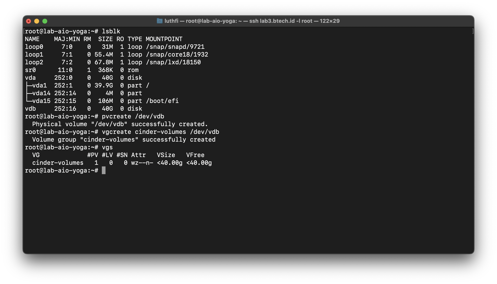
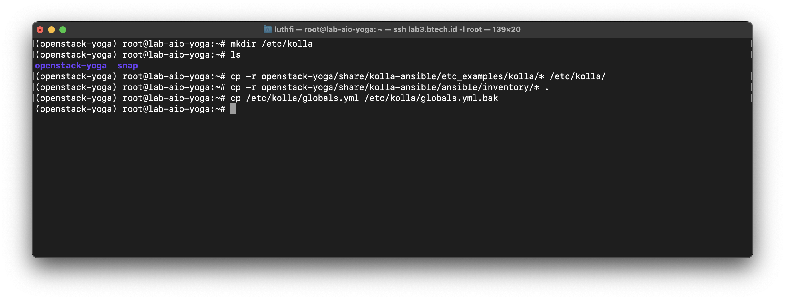
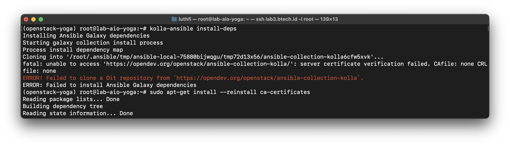
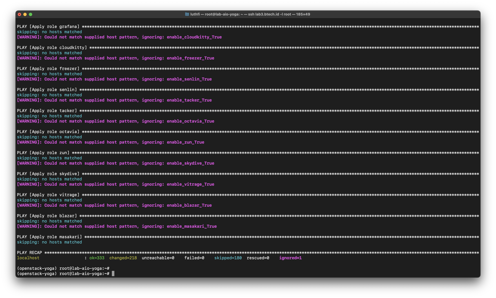
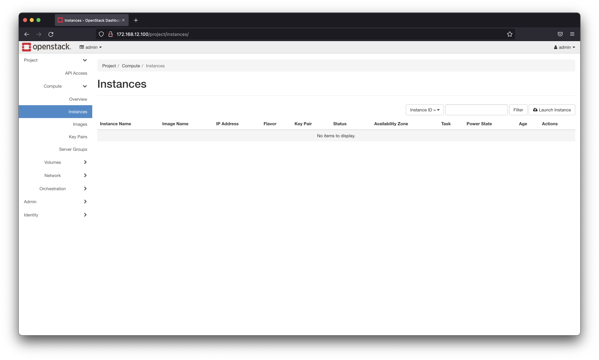

---
> Specification : OpenStack Yoga, Kolla-ansible, Ubuntu, All-in-one


&nbsp;
## **Lab Topology**


&nbsp;
|  Specs  |       Value       |
|:------------:|:-----------------:|
| OS | Ubuntu 20.04   |
| vCPU | 4    |
| RAM | 8GB    |
| Storage 1 | /dev/vda 40 GB    |
| Storage 2 | /dev/vdb 40 GB    |

---

&nbsp;

## **Before start**
Makesure your environment already here :


## **Installation**
### Update Environment 
```
sudo apt update
```

### Create VG for cinder-backend (volume instances)

```
pvcreate /dev/vdb
vgcreate cinder-volumes /dev/vdb
vgs
```



### Install depedencies
```
sudo apt install python3-dev libffi-dev gcc libssl-dev python3-venv
```


### Create virtual environment (venv) for openstack installation

```
python3 -m venv openstack-yoga
source openstack-yoga/bin/activate
```


### Install Pip & Ansible
For openstack yoga version, you need install ansible version like bellow

```
pip install -U pip
pip install docker
pip install 'ansible>=4,<6'
```


### Install Kolla

```
pip install kolla-ansible==14.2.0
```


### Create kolla directory and copy file needed

```
mkdir /etc/kolla
cp -r openstack-yoga/share/kolla-ansible/etc_examples/kolla/* /etc/kolla
cp openstack-yoga/share/kolla-ansible/ansible/inventory/* .
mv /etc/kolla/globals.yml /etc/kolla/globals.yml.bak
```




### Configure global configuration
You can configure base on you needed, but for minimal and in this scenario like bellow :

```
nano /etc/kolla/globals.yml
```


Follow bellow guide :

```
kolla_base_distro: "ubuntu"
kolla_install_type: "source"
openstack_release: "yoga"

kolla_internal_vip_address: "172.168.12.100"
network_interface: "ens3"
neutron_external_interface: "ens4"
neutron_plugin_agent: "openvswitch"
api_interface: "ens3"
enable_keystone: "yes"
enable_neutron_trunk: "yes"

enable_cinder: "yes"
enable_cinder_backup: "no"
enable_cinder_backend_lvm: "yes"
enable_horizon: "yes"
enable_neutron_provider_networks: "yes"
```


### Prepare & setup ansible 

```
mkdir /etc/ansible
nano /etc/ansible/ansible.cfg
```

add value like bellow :

```
[defaults]
host_key_checking=False
pipelining=True
forks=100
```

### Generate Kolla-Password 

```
kolla-genpwd
```

### OpenStack yoga installation


```
ansible -i all-in-one all -m ping
kolla-ansible install-deps

```

If you have **error installation** like bellow you just need install packages, then continue again :

```
apt install --reinstall ca-certificates
```




### Next, bootstrap & deploy openstack

Makesure all deployment not have issue :

```
kolla-ansible -i all-in-one bootstrap-servers
kolla-ansible -i all-in-one prechecks
kolla-ansible -i all-in-one deploy
kolla-ansible -i all-in-one post-deploy 
```




### Verify
Verify all container up 

```
docker ps 
```


### Get openstack horizon password


```
cd /etc/kolla
grep keystone_admin_password /etc/kolla/passwords.yml
```


### Open Dashboard
Input VIP address, and paste your password from previous :





### Install openstack-client to manages with CLI
```
pip install python-openstackclient
```


### Use openstack CLI 
```
cd /etc/kolla
source admin-openrc.sh
openstack server list 
```
&nbsp;

### **Next, Creating Instances**
For create instances, you can check next post 


&nbsp;
&nbsp;
###  Reference :

https://docs.openstack.org/project-deploy-guide/kolla-ansible/yoga/quickstart.html