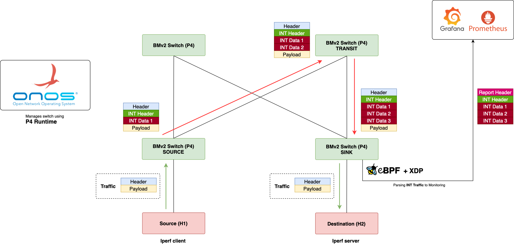
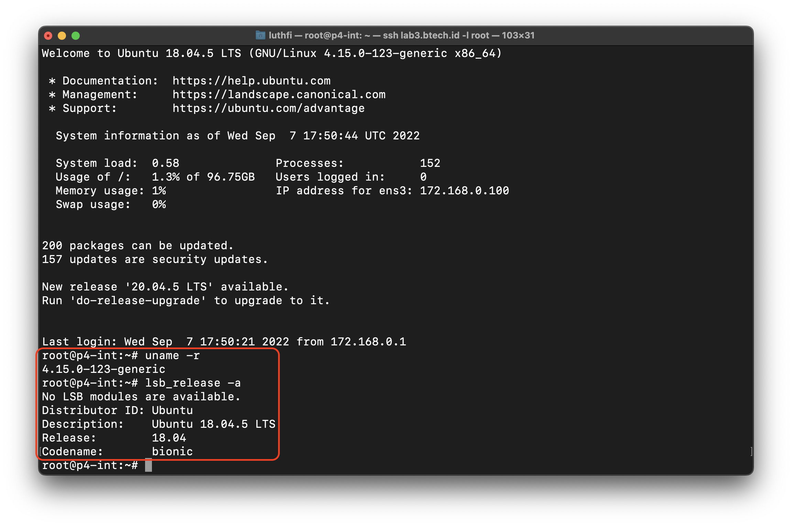
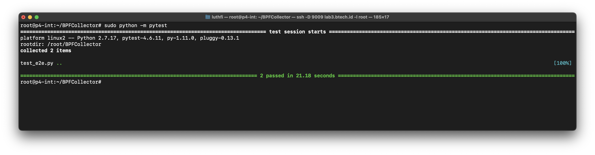
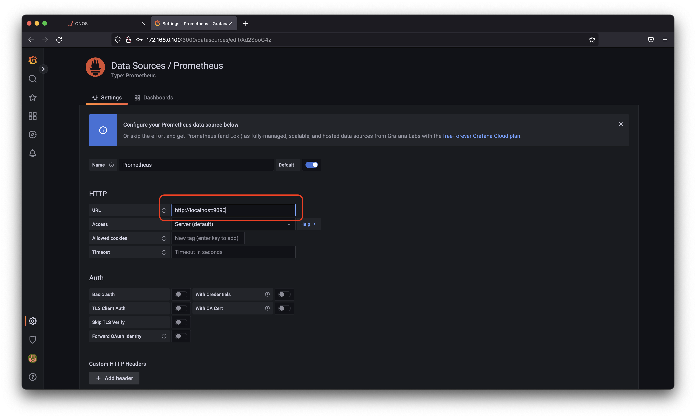
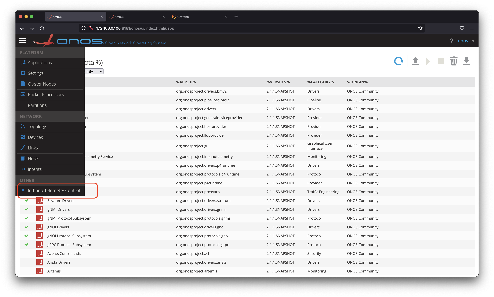
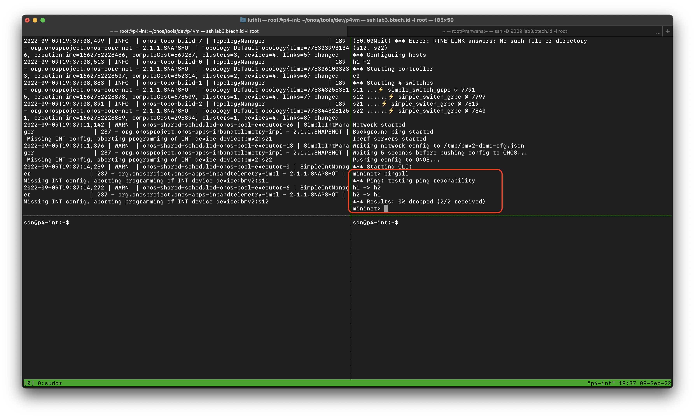
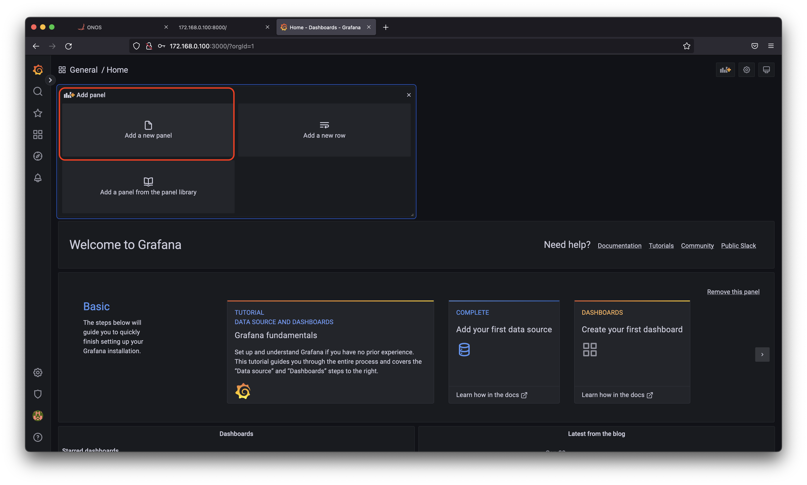

---
> Specification : In-band Network Telemetry, ONOS, P4, eBPF, XDP

## **Detailed Lab Diagram**



&nbsp;


## **General Lab Diagram**


&nbsp;
&nbsp;

---
&nbsp;


### **Summary steps**
- Install all depedencies
- Install all packages needed
- Running ONOS
- Running Mininet with BMv2
- Running INT Apps
- Running Parser, XDP & eBPF
- Adding Data to Grafana
- Verify


### **System requirements**
- Ubuntu 18.04 
- RAM = 8 GB (Prefer 16GB)
- vCPU = 4 (Prefer 8)
- **Root user**
  
### **Preparation**

Make sure kernel & version of **ubuntu** like bellow, you can use above version, but bellow already tested.



###### 1. Clone repository

```
sudo su
apt update
git clone https://github.com/opennetworkinglab/onos.git -b onos-2.1
```

###### 2. Running Root-bootstrap

This activity will install automatically packages bellow : 

- Installing all depedencies 
- creating sdn user 
- Installing bazel

Make sure you already on root user, this command will finished until 20-30 minutes, let's create coffee first :)


Download root-bootstrap.sh here : [https://github.com/assyafii/ONOS-P4-INT/blob/main/root-bootstrap.sh](https://github.com/assyafii/ONOS-P4-INT/blob/main/root-bootstrap.sh)


```
cd /root/onos/tools/dev/p4vm
mv root-bootstrap.sh root-bootstrap.sh.bak 
sudo nano root-bootstrap.sh

Note : Copy & paste from Github

bash root-bootstrap.sh
```

Makesure completed installation like bellow 


###### 3. Running User-bootstrap

Then we continue to install all packages, user-bootstrap include :

- ONOS Apps
- Mininet + BMv2 
- Build P4 Tools


Download user-bootstrap.sh here : [https://github.com/assyafii/ONOS-P4-INT/blob/main/user-bootstrap.sh](https://github.com/assyafii/ONOS-P4-INT/blob/main/user-bootstrap.sh)


```
cd /root/onos/tools/dev/p4vm
mv user-bootstrap.sh user-bootstrap.sh.bak
sudo nano user-bootstrap.sh

Note : Copy & paste from Github

su sdn 'user-bootstrap.sh'
```

Makesure completed installation like bellow 


###### 4. Build ONOS
Take time for first time building, for second & next will not


```
su sdn
cd ~/onos/
```

First, we need modified replace **HTTP to HTTPS**, this important, if you not follow this, installation **will failed**.

```
sed -i 's/http:/https:/g' ~/onos/tools/build/bazel/generate_workspace.bzl
sudo cat ~/onos/tools/build/bazel/generate_workspace.bzl | grep https:
bazel run onos-local clean
```


**Open ONOS Dashboard using**

```
http://ip_onos:8181/onos/ui/index.html
```

```
user = onos
password = rocks
```


**After verify, closed ONOS first, to continue activity**

In terminal press
```
CTRL + C
```


###### 5. Build BCC (BPF Compiler Collection)
This activity will take time, ETA 30-60 minutes, enjoy with coffee first :)


```
sudo apt -y install bison build-essential cmake flex git libedit-dev libllvm3.9 llvm-3.9-dev libclang-3.9-dev python zlib1g-dev libelf-dev clang-3.9
wget https://github.com/iovisor/bcc/archive/refs/heads/tag_v0.7.0.zip
unzip tag_v0.7.0.zip
sudo mv bcc-tag_v0.7.0 bcc 
mkdir bcc/build; cd bcc/build
cmake .. -DCMAKE_INSTALL_PREFIX=/usr
make
sudo make install
```


###### 6. Download BPF Collector 

```
cd ~
git clone https://gitlab.com/tunv_ebpf/BPFCollector.git
cd BPFCollector
git checkout -t origin/spec_1.0
```

###### 7. Activate BPF & Create new virtual interface
This interface will used for parser, if you **reboot** VM later, you need add this interfaces again

```
sudo sysctl net/core/bpf_jit_enable=1
pip install cython
sudo ip link add veth_1 type veth peer name veth_2 
sudo ip link set dev veth_1 up 
sudo ip link set dev veth_2 up 
```


### **Monitoring Section**


###### 1. Install InfluxDB

```
sudo curl -sL https://repos.influxdata.com/influxdb.key | sudo apt-key add -
sudo echo "deb https://repos.influxdata.com/ubuntu bionic stable" | sudo tee /etc/apt/sources.list.d/influxdb.list
sudo apt update
sudo apt install influxdb
```

Make sure installation success.
```
sudo systemctl stop influxdb
sudo systemctl start influxdb
sudo systemctl enable --now influxdb
sudo systemctl is-enabled influxdb
sudo systemctl status influxdb
```


###### Testing BPF Collector connectivity
Before continue installation, we test BPF first like bellow 

```
sudo pip install influxdb

cd ~/BPFCollector
sudo pip install pytest
sudo python -m pytest 
```

**Make sure your connectivity green collor like bellow**




###### 2. Install Prometheus

```
cd ~
pip install prometheus-client
wget https://s3-eu-west-1.amazonaws.com/deb.robustperception.io/41EFC99D.gpg | sudo apt-key add -
sudo apt update
sudo apt -y install prometheus
sudo systemctl start prometheus
sudo systemctl enable prometheus
sudo systemctl status prometheus
```


###### 3. Add INT exporter to Prometheus

```
sudo nano /etc/prometheus/prometheus.yml
```

```
  - job_name: p4switch
    static_configs:
      - targets: ['localhost:8000']
```


**Save & restart services**

```
sudo sytemctl restart prometheus
sudo sytemctl status prometheus
```


###### 4. Install Grafana

```
nano grafana.sh
sudo apt-get install gnupg2 curl software-properties-common -y
curl https://packages.grafana.com/gpg.key | sudo apt-key add -
sudo add-apt-repository "deb https://packages.grafana.com/oss/deb stable main"
sudo apt-get update -y
sudo apt-get install grafana -y
sudo systemctl daemon-reload
sudo systemctl enable grafana-server
sudo systemctl start grafana-server
sudo systemctl status grafana-server
```


**Access Grafana**
Login with default credentials

```
http://your_ip:3000

username : admin
password : admin
```


###### 5. Add data source 


Add prometheus data source 



Make sure data source working 


### **Update BMv2 Topology**


```
su sdn
cd ~
sudo nano $ONOS_ROOT/tools/test/topos/bmv2-demo.py
```

###### 1. Add Intf module

```
Intf
```


###### 2. Add Virtual interface

```
collectorIntf = Intf( 'veth_1', node=net.nameToNode[ "s12" ] )
```


&nbsp;

---

&nbsp;
### **Running ONOS-INT P4**
This section you need open **4 terminal**, you can use `Tmux` for it or open **4 Tab terminal**

#### Terminal 1 (Running ONOS)

```
su sdn
cd ~/onos/
bazel run onos-local clean
```


**Activate ONOS application**

Then, open ONOS Dashboard & activate application like bellow 

**1. Reactive Forwarding**


**2. Proxy ARP**


**3. INT Dashboard**


Choose **Yes** for confirm


Yeay, your INT dashboard already activated



#### Terminal 2 (Running Mininet-BMv2)

```
su sdn
cd ~
sudo -E $ONOS_ROOT/tools/test/topos/bmv2-demo.py --onos-ip=127.0.0.1 --pipeconf-id=org.onosproject.pipelines.int
```


**NOTES : If first time running, have error like bellow, just enter `exit` & Running again**


**Running Mininet again, until bellow**

Make sure ping connection success


#### Terminal 3 (Running BPF Parser)

```
su sdn 
cd ~ 
sudo python BPFCollector/PTClient.py veth_2
```


#### Terminal 4 (Add mirroring)

```
su sdn 
cd ~ 
simple_switch_CLI --thrift-port `cat /tmp/bmv2-s12-thrift-port`
```
```
mirroring_add 500 4
```


###### Note : To get value `4` above
You can check on onos dashboard like bellow :


#### Back to terminal 2 (Generate traffic)

- **H2** = as a iperf server using UDP traffic (Port 5001)
- **H1** = as a iperf server, generate trafic to H2
- You can customize how much traffic and others for iperf.

```
h2 iperf -s -u &
h1 iperf -c h2 -u -t 1000 -i 1 
```


&nbsp;

---

&nbsp;
### **Verify network & add INT Flow (Rule)**

###### 1. You can see traffic bellow 

Note : Press **H** to show host, & triple **L** to show links


###### 2. Add INT Collector
By default using port **54321**, this can customize on PTCollector file 


###### 3. Add INT flow (Rule)
Add INT rule, in this case we will monitor protocol UDP Port 5001 from H1 to H2, **so if any traffic on that, INT apps will add new INT header, you can see on Lab Detailed Diagram above**


###### 4. Check prometheus status


###### 5. Check INT metrics 
Yeay :)  


### **Last step, add metrics to visualization**

**Add new panel**


**Choose metrics name**


**And you can see visualization :)**


#### Video guide
Section using 4 terminal is hard, you can see my video guide on youtube (video last 2 years, but same)


#### Thankyou
Enjoy your lab & Hopefully we can learning & sharing.

&nbsp;

#### Reference
- https://www.sdnlab.com/24279.html
- https://wiki.onosproject.org/display/ONOS/In-band+Network+Telemetry+%28INT%29+with+ONOS+and+P4
- https://github.com/opennetworkinglab/onos

