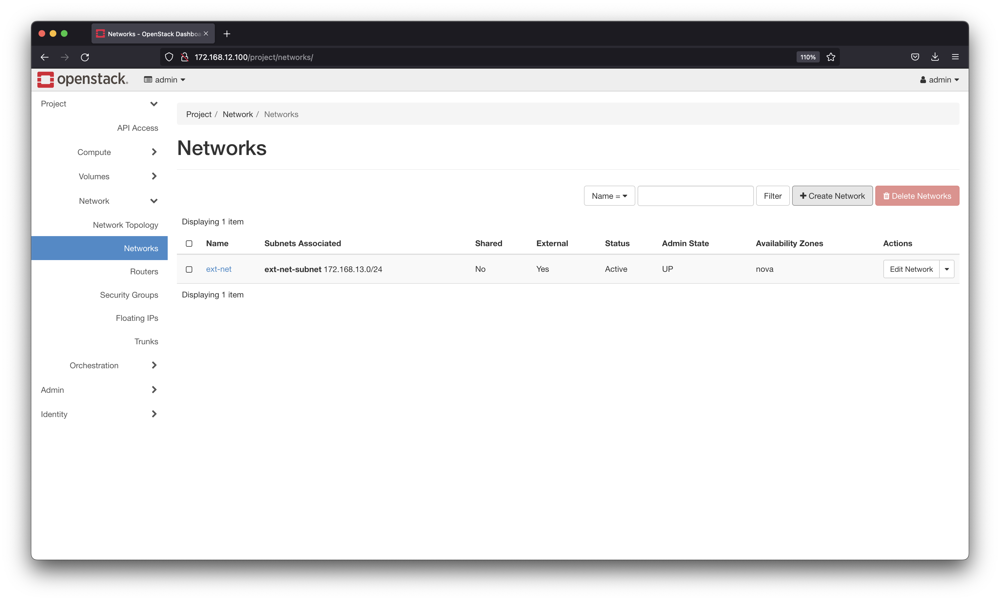
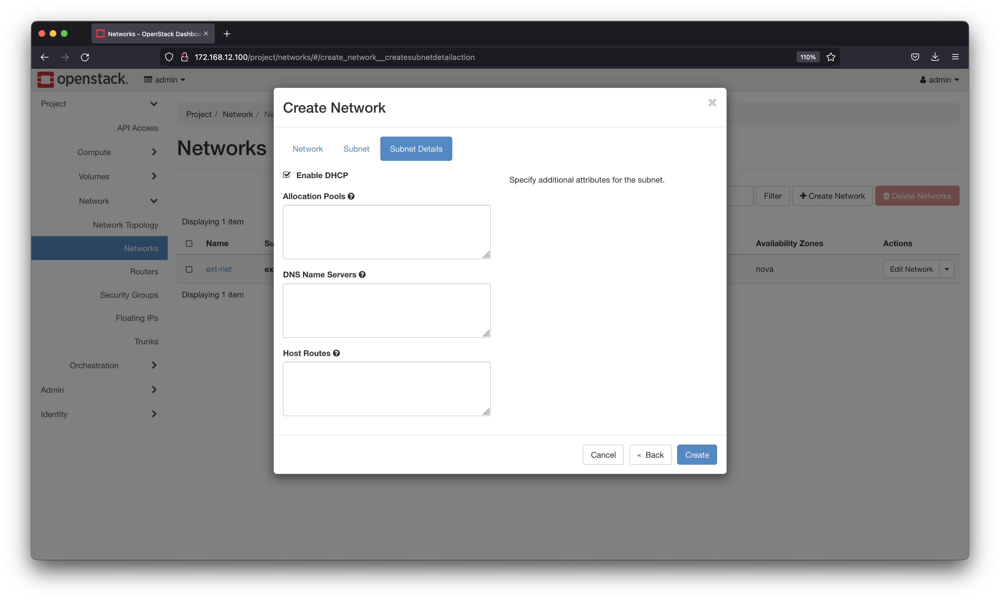
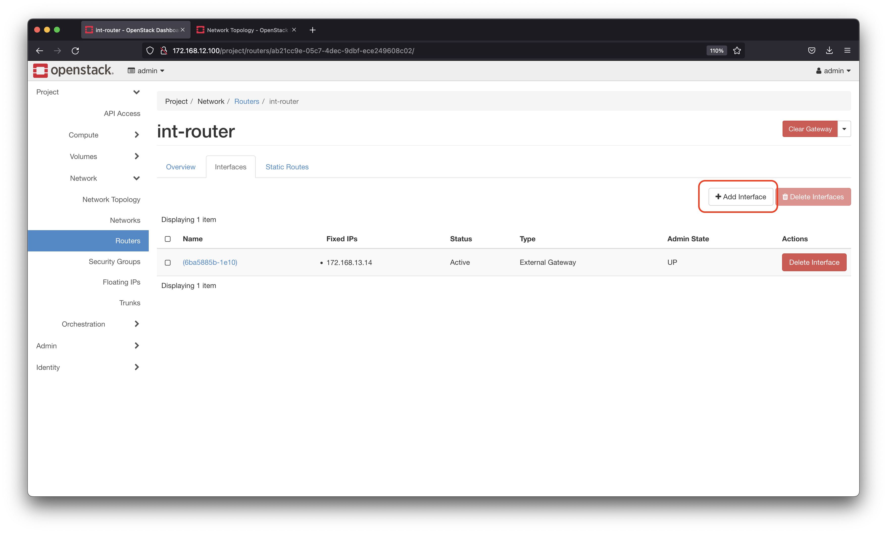
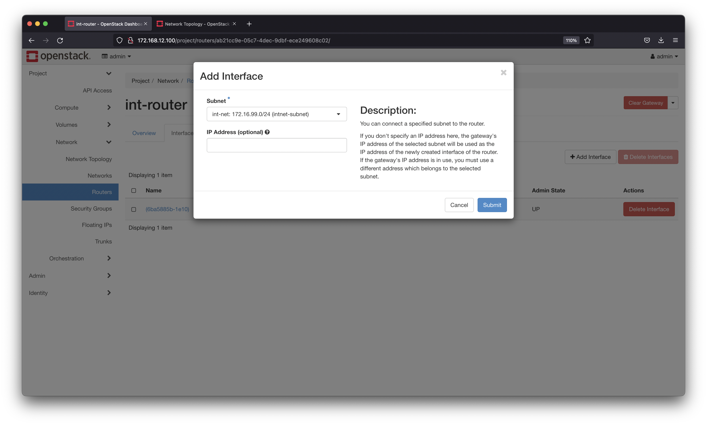
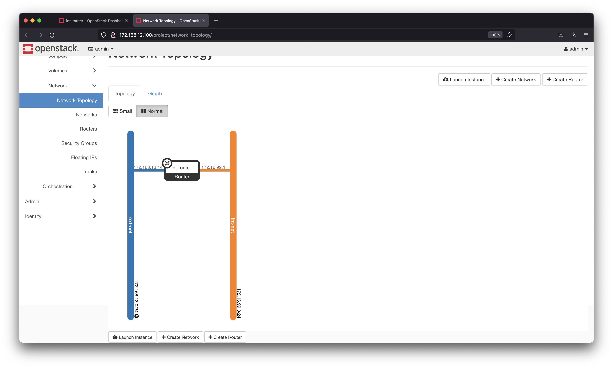
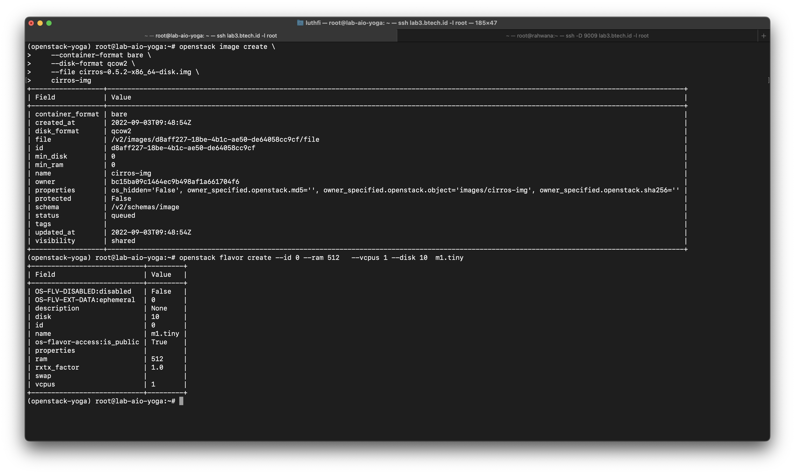
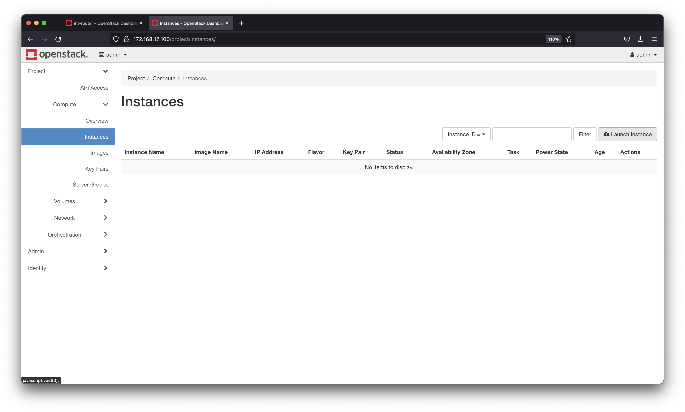
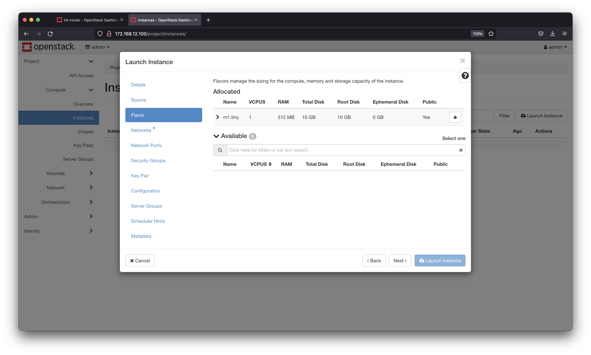

---
> Specification : openstack, internal & external networks, flavor, images, instances, key, security groups

### **Summary step** 

 1. Create external network
 2. Create router
 3. Create internal network
 4. Add internal network to router
 5. Create images
 6. Create flavor 
 7. Create Instances & key
 8. Add floating IP
 9. Create security groups
 10. Add SG to instances
 11. Verify VM connectivity

&nbsp;

---

&nbsp;
&nbsp;

### **Step 1 by 1** 

#### 1. Create external network 
Goto admin pages, and please follow guide correctly 


Make **Physical Network** use **physnet1**


Add **Network address** by using **ens4** network address, because for external & floating IP, make sure this network can connect to internet.


#### 2. Create router

Add router 


Make sure **external network** using previously created


#### 3. Create Internal network
This network for instances private IP, you can use custom address





You can choose anything private address :




#### 4. Add internal network to router
Back again to router menu, and add internal network on router like bellow :


Make sure network correct :



#### 5 & 6, Create images & Flavor

We use lightweight image with cirros 

```
wget http://download.cirros-cloud.net/0.5.2/cirros-0.5.2-x86_64-disk.img
```


**Create image**
```
openstack image create \
    --container-format bare \
    --disk-format qcow2 \
    --file cirros-0.5.2-x86_64-disk.img \
    cirros-img
```

**Create flavor**

```
openstack flavor create --ram 512  --vcpus 1 --disk 10 m1.tiny
```




#### 7. Create instances



add VM name


Chosse cirros image


Choose flavor


Choose internal network 


Create new keypair or you can paste pubkey


#### 8. Add floating IP

Click on instances, choose floating ip address


For pool, you need use external network 


Yeay, you already have floating IP


#### 9. Create security group
security group like firewall, you can open or closed port, by default deny all, we need create first to open

Go to security groups menu


Add rule for allow, bellow example allow all ICMP


allow all TCP (Only for test, better open by need)


#### 10. Add SG to instances


#### 11. Verify VM connectivity
Bellow you can see, we can access VM using Floating IP & VM can ping to internet :)


## Thankyou