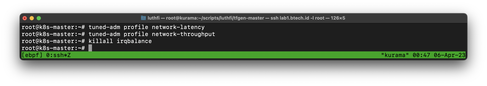

---
> Specification : eBPF, Cilium, Kubernetes, Performance

## Lab Diagram


---

Above we have 3 VM for kubernetes cluster with specification :
- Ubuntu 22.04 **(Kernel 5.15)**
- Master node : 4/8 vCPU/RAM
- Worker node : 6/12 vCPU/RAM

#### System requirements 
- Linux kernel >= 4.19.57 

In this case **i used ubuntu 22.04 with 5.15 default kernel**, because depends to ebpf performance **tuning** later.
More detail about requirements of cilium ebpf you can check here : https://docs.cilium.io/en/v1.13/operations/system_requirements/


#### Summary Step
1. OS level tuning
2. Install kubernetes packages
3. Initiate k8s cluster 
4. Setup Cilium CNI  
5. Testing deployment & services
6. Enable hubble & monitoring 

*Note : Step 7-8 in part 2*

7. Enable Tetragon security
8. Testing security enforcement 

*Note : step 9-11 in part 3*

9.  Enable service mesh
10. API Gateway, Ingress, LB, Traffic Management
11. Deploy example apps

---

This lab propose for **production grade** & need performance, so my guide reference tuning from : https://docs.cilium.io/en/v1.13/operations/performance/tuning/#performance-tuning

## Let's start
### 1. Kernel modification (optional)

Default ubuntu 22.04 kernel use **generic**


In this changes i change to **lowlatency** based kernel

```
sudo apt update
sudo apt-get -y install linux-lowlatency
```

Add parameter bellow :
```
sudo nano /etc/default/grub

GRUB_FLAVOUR_ORDER="lowlatency"
GRUB_DISABLE_OS_PROBER=false 
```


Update grub & reboot 
```
update-grub
reboot
```

You can see here, kernel changed use **lowlatency**
```
uname -r 
```


### 2. OS Level tuning
This based on : https://docs.cilium.io/en/v1.13/operations/performance/tuning/#performance-tuning my configuration based on **hardware support** & performance propose :

#### Tuned ADM
```
apt install tuned -y 
tuned-adm profile network-latency network-throughput
```


#### killall irqbalance
```
killall irqbalance
```




#### Setup jumbo frame (if your network support)

```
ip link show | grep mtu
ip link set ens3 mtu 9000 
```

&nbsp;

### 3. Install kubernetes packages
#### Execute on all nodes

Install all k8s packages, you can use specific k8s version or latest 

```
sudo apt install apt-transport-https curl
curl -fsSL  https://packages.cloud.google.com/apt/doc/apt-key.gpg|sudo gpg --dearmor -o /etc/apt/trusted.gpg.d/k8s.gpg
curl -s https://packages.cloud.google.com/apt/doc/apt-key.gpg | sudo apt-key add -
sudo apt-add-repository "deb http://apt.kubernetes.io/ kubernetes-xenial main"
sudo apt update -y
sudo apt -y install vim git curl wget kubelet kubeadm kubectl
sudo apt-mark hold kubelet kubeadm kubectl
```


#### Disable swap
```
sudo swapoff -a
sudo sed -i '/ swap / s/^\(.*\)$/#\1/g' /etc/fstab
```

#### load br_netfilter module 

```
sudo modprobe overlay
sudo modprobe br_netfilter
```

```
sudo tee /etc/sysctl.d/kubernetes.conf<<EOF
net.bridge.bridge-nf-call-ip6tables = 1
net.bridge.bridge-nf-call-iptables = 1
net.ipv4.ip_forward = 1
EOF
```
```
sysctl --system
```

#### Configure containerd modules
```
cat <<EOF | sudo tee /etc/modules-load.d/containerd.conf
overlay
br_netfilter
EOF
```
```
sudo modprobe overlay
sudo modprobe br_netfilter
```

#### Setup required sysctl params, these persist across reboots.
```
cat <<EOF | sudo tee /etc/sysctl.d/99-kubernetes-cri.conf
net.bridge.bridge-nf-call-iptables  = 1
net.ipv4.ip_forward                 = 1
net.bridge.bridge-nf-call-ip6tables = 1
EOF
```
```
sudo sysctl --system
```


#### Add containerd repository


```
sudo apt install -y curl gnupg2 software-properties-common apt-transport-https ca-certificates
wget -O - https://download.docker.com/linux/ubuntu/gpg > ./docker.key
gpg --no-default-keyring --keyring ./docker.gpg --import ./docker.key
gpg --no-default-keyring --keyring ./docker.gpg --export > ./docker-archive-keyring.gpg
sudo mv ./docker-archive-keyring.gpg /etc/apt/trusted.gpg.d/
sudo add-apt-repository "deb [arch=amd64] https://download.docker.com/linux/ubuntu $(lsb_release -cs) stable"
```

#### Install container packages
```
sudo apt update -y
sudo apt install -y containerd.io
sudo mkdir -p /etc/containerd
containerd config default | sudo tee /etc/containerd/config.toml
sudo sed -i 's/SystemdCgroup \= false/SystemdCgroup \= true/g' /etc/containerd/config.toml
```

```
sudo systemctl restart containerd
sudo systemctl enable containerd
sudo systemctl status containerd
```

#### Make sure your containerd is active


&nbsp;


## 4. Initiate cluster

#### Add host mapping
Adjust with your lab


#### Create kubeadm config for initiate cluster
Make sure **skipPhases kubeproxy** because will use eBPF for routing


```shell
cat <<EOF | tee kubeadm-config.yaml
---
apiVersion: kubelet.config.k8s.io/v1beta1
kind: KubeletConfiguration
cgroupDriver: systemd
kubeReserved:
  cpu: "1000m"
  memory: "2Gi"
systemReserved:
  cpu: "1000m"
  memory: "2Gi"
evictionHard:
  memory.available: "100Mi"
containerLogMaxSize: "20Mi"
containerLogMaxFiles: 2
---
apiVersion: kubeadm.k8s.io/v1beta3
kind: InitConfiguration
skipPhases:
  - addon/kube-proxy
---
apiVersion: kubeadm.k8s.io/v1beta3
kind: ClusterConfiguration
clusterName: cluster.local
networking:
  dnsDomain: cluster.local
  serviceSubnet: "10.96.0.0/12"
  podSubnet: "10.244.0.0/16"
kubernetesVersion: stable
controlPlaneEndpoint: k8s-master:6443
apiServer:
  extraArgs:
  certSANs:
  - localhost
  - 127.0.0.1
EOF
```

#### Init cluster

```
kubeadm init --config=kubeadm-config.yaml --upload-certs 
```

#### Bellow for success initiate


#### Join your workers node
```
kubeadm join k8s-master:6443 --token <xxxxxxxx> \
        --discovery-token-ca-cert-hash sha256:<xxxxxxx> 
```

#### Add worker label
```
kubectl label node k8s-node-1 node-role.kubernetes.io/worker=worker
kubectl label node k8s-node-2 node-role.kubernetes.io/worker=worker
```

**Ignore** not-ready on nodes because it has not been configured cilium CNI.


## 5. Deploying cilium CNI

#### Install Helm 

```
curl -fsSL -o get_helm.sh https://raw.githubusercontent.com/helm/helm/main/scripts/get-helm-3
chmod 700 get_helm.sh
./get_helm.sh
```

#### Add Helm cilium repo
```
helm repo add cilium https://helm.cilium.io/
helm repo update
```

#### Deploy cilium with eBPF enable
```
helm install cilium cilium/cilium \
    --namespace kube-system \
    --set kubeProxyReplacement=strict \
    --set k8sServiceHost=10.10.20.100 \
    --set externalIPs.enabled=true \
    --set k8sServicePort=6443 \
    --set bpf.hostLegacyRouting=false \
    --set bpf.masquerade=true 
```

#### Deploy cilium with eBPF enable

Notes :
- kubeProxyReplacement : Not using kubeproxy 
- ExternalIPs.enabled : Allow external IP to access internal
- bpf.hostLegacyRouting : Using eBPF host routing,  to fully bypass iptables
- bpf.masquerade : eBPF based masquerading

#### Make sure like this :


#### Check also cilium POD status 


#### Verify cilium system status 

Execute on of a cilium POD like bellow :


#### OR, you can use cilium CLI

Install Go & Cilium CLI
```
sudo apt install golang-go
```
```
CILIUM_CLI_VERSION=$(curl -s https://raw.githubusercontent.com/cilium/cilium-cli/master/stable.txt)
GOOS=$(go env GOOS)
GOARCH=$(go env GOARCH)
curl -L --remote-name-all https://github.com/cilium/cilium-cli/releases/download/${CILIUM_CLI_VERSION}/cilium-${GOOS}-${GOARCH}.tar.gz{,.sha256sum}
sha256sum --check cilium-${GOOS}-${GOARCH}.tar.gz.sha256sum
sudo tar -C /usr/local/bin -xzvf cilium-${GOOS}-${GOARCH}.tar.gz
rm cilium-${GOOS}-${GOARCH}.tar.gz{,.sha256sum}
```

```
cilium status
```


## 6. Testing create deployment
```
kubectl apply -f https://k8s.io/examples/controllers/nginx-deployment.yaml
kubectl expose deployment nginx-deployment --type=ClusterIP --name=nginx-service
kubectl get svc 
```


---

## Enable Hubble (observability)
Upgrade your helm chart with **--reuse-values** for not replace existing 

```
helm upgrade cilium cilium/cilium \
    --namespace kube-system \
    --reuse-values \
    --set hubble.enabled=true \
    --set hubble.listenAddress=":4244" \
    --set hubble.relay.enabled=true \
    --set hubble.ui.enabled=true \
    --set hubble.metrics.enableOpenMetrics=true \
    --set hubble.metrics.enabled="{dns:query;ignoreAAAA,drop,flow,flows-to-world,httpV2:exemplars=true;labelsContext=source_ip\,source_namespace\,source_workload\,destination_ip\,destination_namespace\,destination_workload\,traffic_direction,icmp,port-distribution,tcp}" 
```

```
kubectl -n kube-system rollout restart deployment/cilium-operator
kubectl -n kube-system rollout restart ds/cilium
```


#### Make sure your POD ready


#### Open Hubble UI


#### Testing curl in default namespaces 
You can see here, we can see flow of apps 


&nbsp;

Bellow example flow for kube-system namespaces


### Enable Metrics & Grafana

```
helm upgrade cilium cilium/cilium \
    --namespace kube-system \
    --reuse-values \
    --set prometheus.enabled=true \
    --set operator.prometheus.enabled=true 
```

```
kubectl -n kube-system rollout restart deployment/cilium-operator
kubectl -n kube-system rollout restart ds/cilium
```

#### Deploy Grafana dashboard
```
kubectl apply -f https://raw.githubusercontent.com/cilium/cilium/1.13.0/examples/kubernetes/addons/prometheus/monitoring-example.yaml
```

Make sure your deployed are ready :


Testing access **Grafana dashboard** using cluster IP or you can changes/patchs to NodePort/ExternalIP


&nbsp;

---

## [Next Part 2 - The power of eBPF Security using Tetragon](https://luthfi.dev/posts/the-power-of-ebpf-security-tetragon-part-2/)