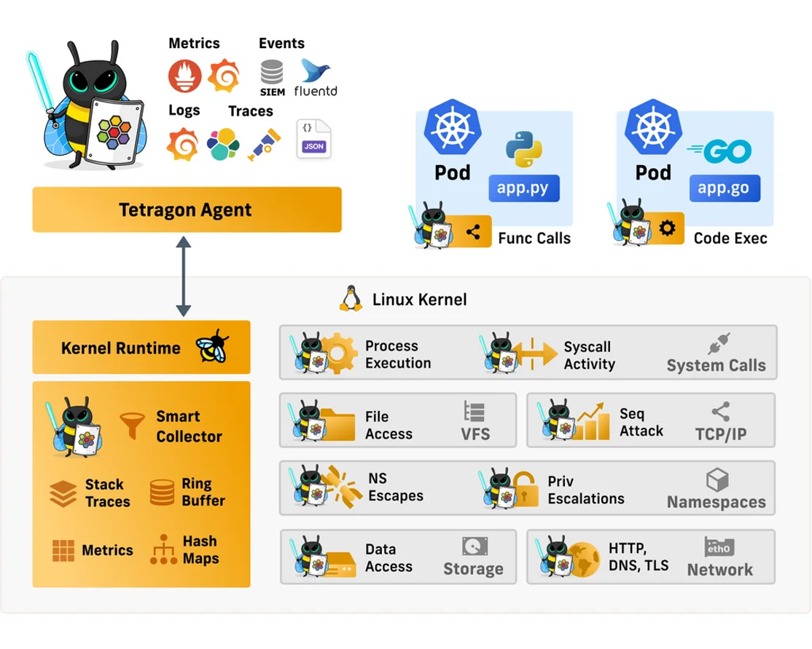
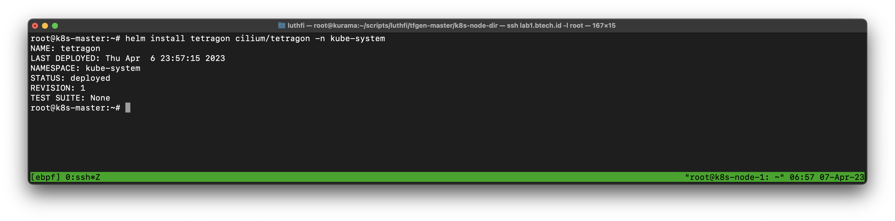
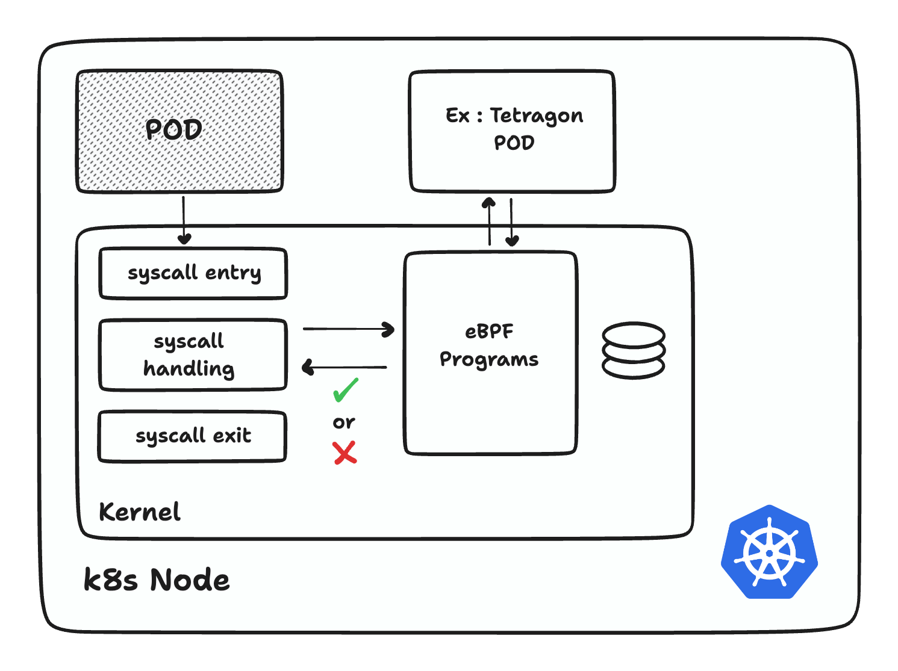
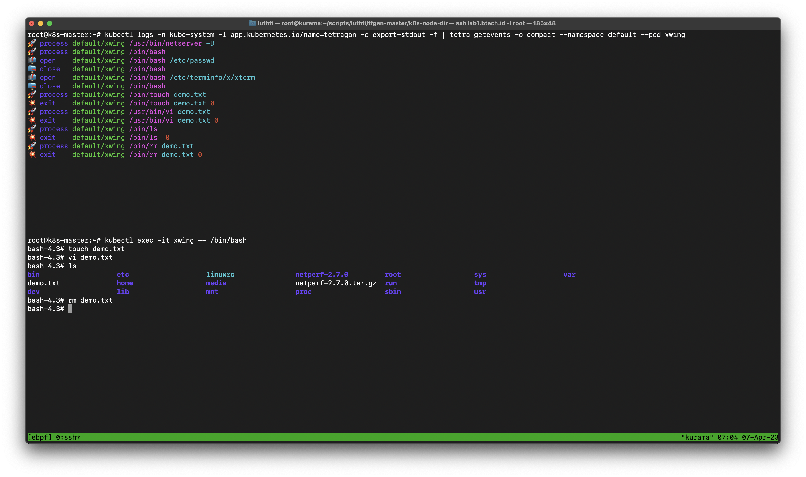
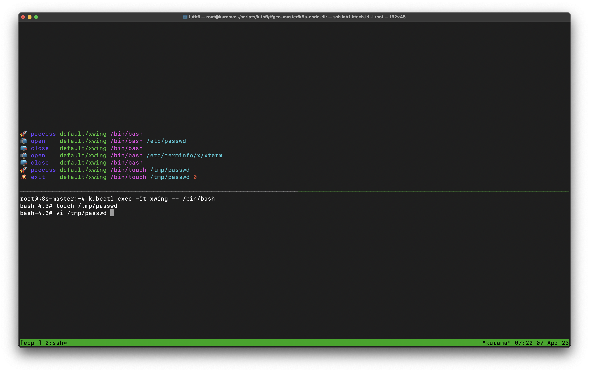
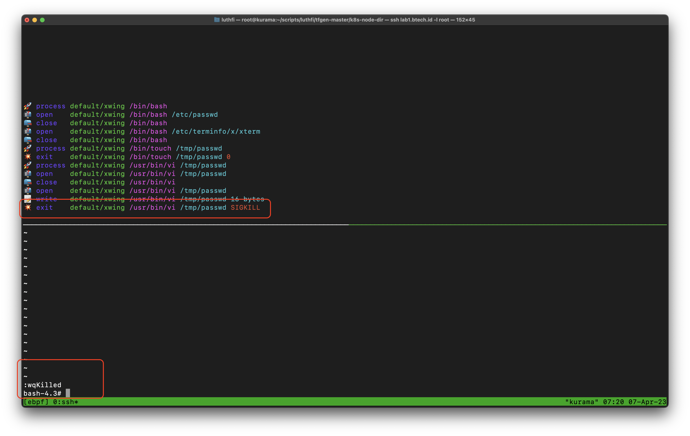

---
> Specification : eBPF, Security, Kernel, Observability, Enforcement


## Tetragon 

**Tetragon** enables powerful realtime, eBPF-based Security Observability and Runtime Enforcement. Tetragon detects and is able to react to security-significant events



source : https://isovalent.com/blog/post/2022-05-16-tetragon/

You can see above tetragon provides :

- Process & Syscall visibility
- File access monitoring  
- Runtime enforcement
- I/O activity
- Mores


---

### Prerequisites
- Make sure you have installed kubernetes with cilium enabled, you can see full for cluster setup on **[Part 1 - Setup Kubernetes + eBPF Cilium with Performance Tuning](https://luthfi.dev/posts/setup-kubernetes-+-ebpf-cilium-with-tuning-performance-part-1/)**


### Enable Tetragon

```
helm install tetragon cilium/tetragon -n kube-system
```




#### Install tetra CLI (mandatory)
```
GOOS=$(go env GOOS)
GOARCH=$(go env GOARCH)
curl -L --remote-name-all https://github.com/cilium/tetragon/releases/latest/download/tetra-${GOOS}-${GOARCH}.tar.gz{,.sha256sum}
sha256sum --check tetra-${GOOS}-${GOARCH}.tar.gz.sha256sum
sudo tar -C /usr/local/bin -xzvf tetra-${GOOS}-${GOARCH}.tar.gz
rm tetra-${GOOS}-${GOARCH}.tar.gz{,.sha256sum}
```

#### Deploy demo application
```
kubectl create -f https://raw.githubusercontent.com/cilium/cilium/v1.11/examples/minikube/http-sw-app.yaml
```

---

## Demo Workaround



For more detail : https://github.com/cilium/tetragon

---

### 1. Monitoring process execution
All execution in POD like command line, open file, and all will be monitored with **process_exec** & **process_exit**

**Apply tracing policy**
```
kubectl apply -f https://raw.githubusercontent.com/cilium/tetragon/main/examples/tracingpolicy/sys_write_follow_fd_prefix.yaml
```

####  Monitoring the events (terminal 1)

```
kubectl logs -n kube-system -l app.kubernetes.io/name=tetragon -c export-stdout -f | tetra getevents -o compact --namespace default --pod xwing
```


#### Login to xwing POD, execute everything you want (terminal 2)

```
kubectl exec -it xwing -- /bin/bash
```


You can see bellow everything you exec detected on kernel 



Or see my **video** :


&nbsp;

---

### 2. SIGKILL process 
In this workaround if you changes someone, your process will automatically stopped by **kernel** with sigkill.

#### Create tracing policy for SIGKILL

```
nano sys_write_sigkill.yaml
```

```yaml
apiVersion: cilium.io/v1alpha1
kind: TracingPolicy
metadata:
  name: "syswritefollowfdpsswd"
spec:
  kprobes:
  - call: "fd_install"
    syscall: false
    args:
    - index: 0
      type: int
    - index: 1
      type: "file"
    selectors:
    - matchArgs:
      - index: 1
        operator: "Equal"
        values:
        - "/tmp/passwd"
      matchActions:
      - action: FollowFD
        argFd: 0
        argName: 1
  - call: "do_dup2"
    syscall: false
    args:
    - index: 0
      type: int
    - index: 1
      type: "file"
    - index: 2
      type: int
    selectors:
    - matchArgs:
      - index: 1
        operator: "Equal"
        values:
        - "/tmp/passwd"
      matchActions:
      - action: FollowFD
        argFd: 2
        argName: 1
  - call: "sys_close"
    syscall: true
    args:
    - index: 0
      type: "int"
    selectors:
    - matchActions:
      - action: UnfollowFD
        argFd: 0
        argName: 0
  - call: "sys_write"
    syscall: true
    args:
    - index: 0
      type: "fd"
    - index: 1
      type: "char_buf"
      sizeArgIndex: 3
    - index: 2
      type: "size_t"
    selectors:
    - matchPIDs:
      - operator: NotIn
        values:
        - 0
        - 1
      matchArgs:
      - index: 0
        operator: "Equal"
        values:
        - "/tmp/passwd"
      matchActions:
      - action: Sigkill
```


#### monitoring the events (terminal 1)
```
kubectl logs -n kube-system -l app.kubernetes.io/name=tetragon -c export-stdout -f | tetra getevents -o compact --namespace default --pod xwing
```

#### Login to xwing POD (terminal 2)
In this POD you need :
- Create file /tmp/passwd
- Add some text on /tmp/passwd
- Save file 
- If success, your execution will **KILLED** by kernel/eBPF

```
kubectl exec -it xwing -- /bin/bash
```
1. create file `/tmp/passwd`, add some text and save file


2. Your file will **KILLED** automatically, because it define on **tracing policy**


Or see my **video** :


#### More for Tracing Policy references
https://github.com/cilium/tetragon/tree/main/examples/tracingpolicy


&nbsp;

---


## Part 3 Service Mesh (will be updated)